# PRD: VXMI 대시보드 관리자 패널 시스템

> **문서 버전:** v1.1
> **작성일:** 2026-03-20
> **최종 수정일:** 2026-03-20
> **작성자:** 밸류커넥트 프로덕트팀
> **상태:** Draft (Architect/Critic Review 반영)
> **대상 프로젝트:** vxmi-dashboard (Hire Intelligence)

---

## 목차

1. [개요 (Overview)](#1-개요-overview)
2. [사용자 역할 및 권한 체계](#2-사용자-역할-및-권한-체계)
3. [SuperAdmin 대시보드 기능 명세](#3-superadmin-대시보드-기능-명세)
4. [User(일반 사용자) 대시보드 기능 명세](#4-user일반-사용자-대시보드-기능-명세)
5. [기술 아키텍처](#5-기술-아키텍처)
6. [UI/UX 설계 가이드](#6-uiux-설계-가이드)
7. [GA4 이벤트 설계](#7-ga4-이벤트-설계)
8. [데이터 모델](#8-데이터-모델)
9. [API 엔드포인트 설계](#9-api-엔드포인트-설계)
10. [프론트엔드 테스트 전략](#10-프론트엔드-테스트-전략)
11. [마일스톤 & 로드맵](#11-마일스톤--로드맵)
12. [성공 지표 (KPIs)](#12-성공-지표-kpis)
13. [리스크 & 대응방안](#13-리스크--대응방안)

---

## 1. 개요 (Overview)

### 1.1 프로젝트 배경

밸류커넥트(ValueConnect)는 채용 시장 인텔리전스 플랫폼 **Hire Intelligence**를 운영하고 있다. 현재 `vxmi-dashboard`는 React 19 + TypeScript + Vite + Tailwind CSS 4 + Recharts 기반의 프론트엔드 애플리케이션으로, 6개의 핵심 분석 뷰를 제공하고 있다:

| 뷰 | 설명 |
|---|---|
| Top 20 채용 볼륨 (`TopCompaniesView`) | 기업별 주간 채용 공고 볼륨 랭킹 |
| 수요공급 매트릭스 (`SDMatrixView`) | 직군별 수요-공급 갭 분석 |
| 시계열 채용 인텔리전스 (`CompanyTimelineView`) | 기업 채용 추이 시계열 분석 |
| 채용 트렌드 (`HiringTrendsView`) | 직군별 채용 트렌드 시각화 |
| 이력서 매칭 (`ResumeMatchView`) | 이력서-기업 적합도 매칭 |
| 기업 분석 (`CompanyAnalysisView`) | 기업별 인재 밀도/채용력/인재 흐름 분석 |

**현재 시스템의 한계:**

- **인증 부재**: Mock 로그인 모달만 존재하며, 실제 인증/인가 시스템 없음
- **라우팅 부재**: `useState` 기반 탭 네비게이션으로, URL 기반 라우팅 미구현
- **백엔드 미연동**: 모든 데이터가 `src/data/*.ts` 내 하드코딩된 Mock 데이터
- **상태관리 부재**: 라이브러리 없이 로컬 `useState`만 사용
- **권한 체계 부재**: 역할 기반 접근 제어(RBAC) 미구현
- **관리 기능 부재**: 유저 관리, 과금, 트래픽 모니터링 등 운영 도구 전무

### 1.2 프로젝트 목표

본 PRD는 VXMI 대시보드에 **역할 기반 관리자 패널 시스템**을 도입하여, 밸류커넥트 내부 운영팀과 일반 사용자 모두에게 적절한 관리 도구를 제공하는 것을 목표로 한다.

**핵심 목표:**

1. **SuperAdmin 패널 구축**: 밸류커넥트 내부 운영팀이 유저, 트래픽, 과금, 데이터를 통합 관리할 수 있는 어드민 대시보드
2. **User 패널 구축**: 일반 사용자가 자신의 프로필, 결제, 사용 이력을 관리할 수 있는 셀프서비스 대시보드
3. **RBAC 시스템 도입**: 계층형 역할 기반 접근 제어를 통한 보안 강화
4. **인증 시스템 구축**: 실제 로그인/회원가입 플로우 구현
5. **GA4 연동**: 서비스 전반의 사용자 행동 분석 체계 구축

### 1.3 프로젝트 범위

**In Scope:**
- 인증/인가 시스템 (JWT + OAuth 2.0)
- 계층형 RBAC (SuperAdmin > User > Guest)
- SuperAdmin 대시보드 (유저관리, 트래픽 모니터링, 과금, 카테고리 관리, GA 연동)
- User 대시보드 (프로필, 결제, 탈퇴, 사용 분석)
- React Router 기반 라우팅 전환
- 상태관리 라이브러리 도입
- Mock API 전략 (MSW 기반 개발 환경)

**Out of Scope:**
- 기존 6개 분석 뷰의 기능 변경 (별도 PRD로 관리)
- 백엔드 API 서버 구축 (별도 PRD, 본 문서에서는 API 인터페이스 설계만 포함)
- 모바일 네이티브 앱
- 실시간 채팅/메시징 기능
- AI/ML 기반 이상 탐지 고도화 (Phase 6 이후)

### 1.4 용어 정의

| 용어 | 정의 |
|---|---|
| SuperAdmin | 밸류커넥트 내부 운영팀 구성원. 전체 시스템 관리 권한 보유. User의 모든 권한을 상속받는다. |
| User | 서비스에 가입한 일반 사용자. 자신의 계정 및 데이터 관리 권한 |
| Guest | 미로그인 방문자. 제한적 데이터 열람만 가능 |
| B2C | 개인 채용 정보 탐색자 (구직자, 커리어 관심자) |
| 인하우스HR | 기업 내부 채용담당자 |
| 헤드헌터 | 서치펌/헤드헌팅 에이전시 소속 리크루터 |
| OTW (Open To Work) | 이직 의향 비율 |
| SD Matrix | 수요(Demand)-공급(Supply) 매트릭스 |
| MSW | Mock Service Worker. 브라우저/Node.js에서 API 요청을 가로채 Mock 응답을 반환하는 라이브러리 |

---

## 2. 사용자 역할 및 권한 체계

### 2.1 역할 정의

#### 역할 계층 구조 (Hierarchical RBAC)

SuperAdmin은 User의 모든 권한을 상속받으며, 추가로 관리 기능에 대한 권한을 보유한다. 이를 통해 권한 누락 없이 일관된 접근 제어를 보장한다.

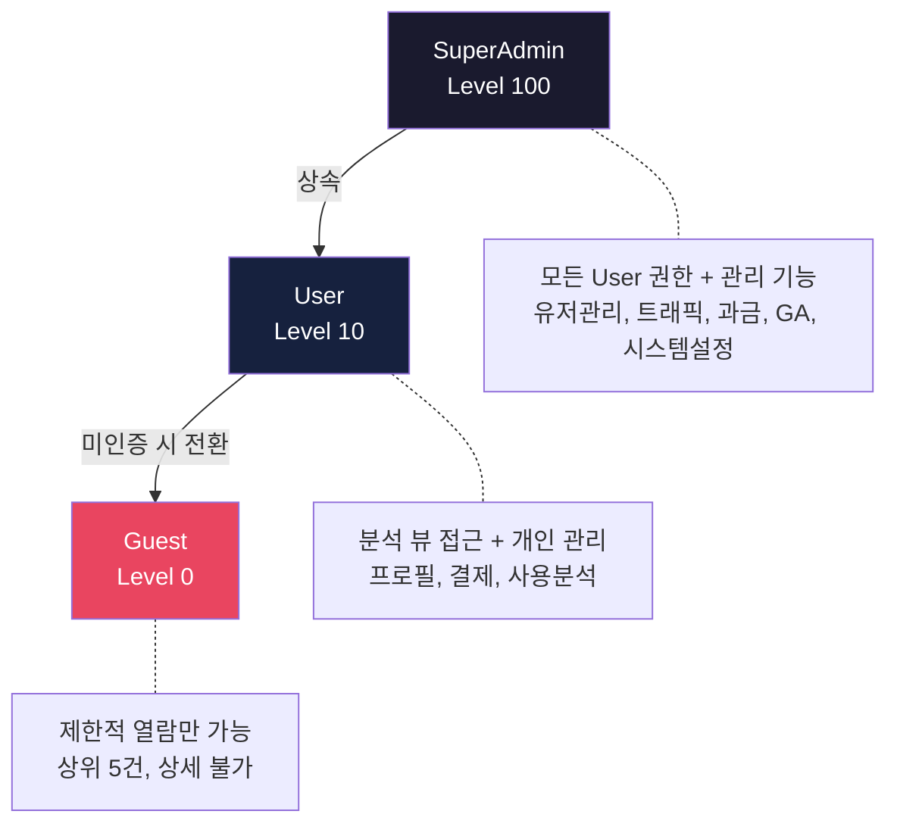

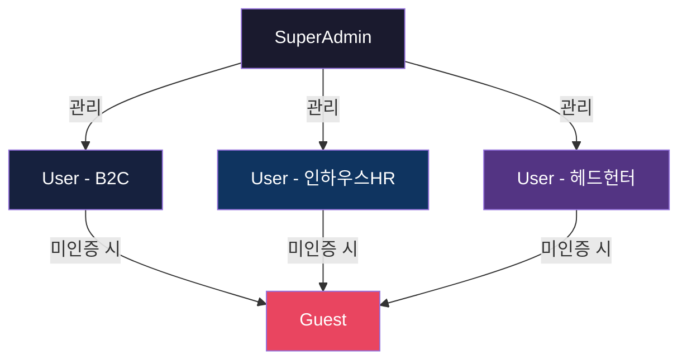

#### SuperAdmin (밸류커넥트 내부 관리자)

| 항목 | 설명 |
|---|---|
| **대상** | 밸류커넥트 운영팀, C-Level, 개발팀 |
| **생성 방식** | 내부 초대 전용 (자체 회원가입 불가) |
| **핵심 권한** | User의 모든 권한을 상속 + 전체 시스템 관리, 유저 관리, 과금 관리, 데이터 무제한 접근 |
| **데이터 제한** | 없음. Pagination 제한 없이 전체 데이터 조회 가능 |
| **세션 만료** | 8시간 (보안 강화) |

#### User (일반 사용자)

| 항목 | 설명 |
|---|---|
| **대상** | 서비스 가입 사용자 |
| **생성 방식** | 자체 회원가입 또는 Google OAuth |
| **카테고리** | B2C, 인하우스HR, 헤드헌터 (가입 시 선택, 이후 변경 요청 가능) |
| **핵심 권한** | 자신의 계정 관리, 요금제에 따른 데이터 접근 |
| **데이터 제한** | 요금제별 일일/월간 API 호출 한도, Pagination 제한 적용 |
| **세션 만료** | 24시간 (Remember Me 선택 시 30일) |

#### Guest (미인증 방문자)

| 항목 | 설명 |
|---|---|
| **대상** | 로그인하지 않은 방문자 |
| **핵심 권한** | 제한된 샘플 데이터 열람, 회원가입 유도 |
| **데이터 제한** | 각 뷰 상위 5건만 노출, 상세 drill-down 불가 |
| **세션 만료** | 해당 없음 |

### 2.2 RBAC 설계

#### 권한 모델 구조

역할은 계층형(Hierarchical)으로 설계한다. `ROLE.level` 값을 통해 상위 역할이 하위 역할의 모든 권한을 자동으로 상속받는다. 또한, 한 명의 User가 복수의 Role을 가질 수 있도록 N:M 관계를 지원한다.

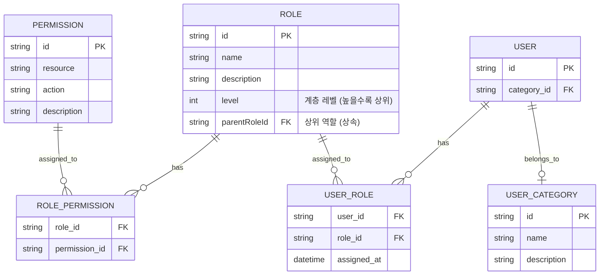

**역할 상속 규칙:**
- `ROLE.level`이 높은 역할은 낮은 역할의 모든 PERMISSION을 자동으로 상속
- SuperAdmin (level=100)은 User (level=10)의 모든 권한을 포함
- 권한 검증 시: `user.roles`에 해당 permission이 직접 매핑되어 있거나, role.level이 해당 permission이 요구하는 최소 level 이상이면 허용

#### 권한 매트릭스 (Permission Matrix)

> **API 호출 한도 규칙:** API 호출 한도는 **요금제(Plan) 한도를 기준**으로 적용하며, 카테고리별 별도 한도는 적용하지 않는다. 동일 요금제를 사용하는 유저는 카테고리에 관계없이 동일한 API 호출 한도를 갖는다.

| 기능 (Resource:Action) | SuperAdmin | User (B2C) | User (인하우스HR) | User (헤드헌터) | Guest |
|---|:---:|:---:|:---:|:---:|:---:|
| **분석 뷰 접근** |
| Top 채용 볼륨 - 전체 조회 | O | O | O | O | 상위 5건 |
| SD 매트릭스 - 전체 조회 | O | O | O | O | 상위 5건 |
| 시계열 인텔리전스 | O | O | O | O | X |
| 채용 트렌드 | O | O | O | O | X |
| 이력서 매칭 | O | X | O | O | X |
| 기업 분석 - 상세 | O | 제한적 | O | O | X |
| **데이터 접근** |
| 무제한 Pagination | O | X | X | X | X |
| 데이터 Export (CSV/Excel) | O | X | 요금제별 | 요금제별 | X |
| Raw 데이터 조회 | O | X | X | X | X |
| API 호출 (일일 한도) | 무제한 | 요금제별 | 요금제별 | 요금제별 | 10회 |
| **관리 기능** |
| 유저 목록 조회/관리 | O | X | X | X | X |
| 유저 상태 변경 | O | X | X | X | X |
| 유저 카테고리 변경 | O | X | X | X | X |
| 과금/빌링 관리 | O | X | X | X | X |
| 트래픽 모니터링 | O | X | X | X | X |
| 이상 징후 탐지 | O | X | X | X | X |
| GA 대시보드 | O | X | X | X | X |
| **개인 관리** |
| 내 프로필 수정 | O | O | O | O | X |
| 내 결제 관리 | O | O | O | O | X |
| 내 사용 분석 | O | O | O | O | X |
| 회원 탈퇴 | X | O | O | O | X |

> **참고:** SuperAdmin의 "내 결제 관리"는 O로, SuperAdmin도 User 권한을 상속받아 개인 결제 정보를 관리할 수 있다. 단, SuperAdmin 계정의 결제/과금은 내부적으로 관리되므로 실제 요금 청구는 발생하지 않는다. SuperAdmin의 "회원 탈퇴"가 X인 이유는 SuperAdmin 계정은 내부 관리 계정으로 자체 탈퇴가 허용되지 않기 때문이다.

**요금제별 API 호출 한도:**

| 요금제 | 일일 한도 | 월간 한도 |
|---|---|---|
| Free | 100회 | 2,000회 |
| Basic | 500회 | 10,000회 |
| Pro | 2,000회 | 50,000회 |
| Enterprise | 무제한 | 무제한 |

### 2.3 권한 검증 흐름

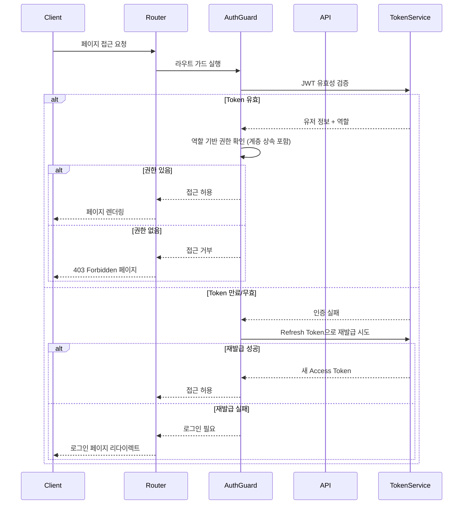

---

## 3. SuperAdmin 대시보드 기능 명세

### 3.1 유저 관리 (User Management)

#### 3.1.1 유저 목록 조회

**화면 구성:**

유저 목록은 테이블 형태로 제공하며, 필터/검색/정렬/페이지네이션을 지원한다.

| 컬럼 | 설명 | 정렬 가능 |
|---|---|:---:|
| 프로필 | 아바타 + 이름 + 이메일 | O (이름순) |
| 카테고리 | B2C / 인하우스HR / 헤드헌터 뱃지 | O |
| 요금제 | Free / Basic / Pro / Enterprise 뱃지 | O |
| 상태 | 활성 / 비활성 / 차단 / 탈퇴대기 | O |
| 가입일 | YYYY-MM-DD 형식 | O |
| 최근 접속 | 상대 시간 (예: "2시간 전") | O |
| 월간 API 호출 | 사용량 / 한도 프로그레스 바 | O |
| 액션 | 상세보기 / 편집 / 차단 드롭다운 | X |

**필터 옵션:**

| 필터 | 타입 | 옵션 |
|---|---|---|
| 카테고리 | Multi-select | B2C, 인하우스HR, 헤드헌터 |
| 요금제 | Multi-select | Free, Basic, Pro, Enterprise |
| 상태 | Multi-select | 활성, 비활성, 차단, 탈퇴대기 |
| 가입 기간 | Date range | 시작일 ~ 종료일 |
| 검색 | Text input | 이름, 이메일, 회사명 검색 |

**페이지네이션:**
- 기본 20건/페이지, 50/100건 선택 가능
- SuperAdmin은 전체 데이터 무제한 조회 가능 (서버는 JWT payload의 role claim으로 pagination 제한을 결정)
- 총 유저 수 표시

#### 3.1.2 유저 상세 정보 조회

유저 목록에서 상세보기 클릭 시 슬라이드 패널 또는 별도 페이지로 표시.

**기본 정보 섹션:**
- 프로필 이미지, 이름, 이메일, 전화번호
- 카테고리, 요금제, 상태
- 가입일, 최근 접속일, 총 접속 횟수
- 인증 방법 (이메일 / Google OAuth)
- 소속 회사명 (인하우스HR / 헤드헌터의 경우)

**사용 통계 섹션:**
- 최근 30일 API 호출 추이 차트 (Recharts Line Chart)
- 주요 이용 기능 Top 5 (Pie Chart)
- 일별 접속 히트맵 (최근 90일)
- 누적 데이터 조회량

**과금 정보 섹션:**
- 현재 요금제 상세
- 결제 이력 (최근 12개월)
- 미결제 청구서 존재 여부
- 할인/크레딧 잔액

**활동 로그 섹션:**
- 최근 활동 타임라인 (로그인, 기능 사용, 설정 변경 등)
- 필터: 활동 유형, 기간

#### 3.1.3 유저 상태 관리

| 상태 | 설명 | 전환 가능 상태 |
|---|---|---|
| `ACTIVE` | 정상 사용 중 | INACTIVE, BLOCKED |
| `INACTIVE` | 비활성 (장기 미접속 자동 전환 등) | ACTIVE, BLOCKED |
| `BLOCKED` | 차단 (이용약관 위반 등) | ACTIVE |
| `PENDING_DELETE` | 탈퇴 대기 (유예 기간 중) | ACTIVE (탈퇴 철회 시) |
| `DELETED` | 탈퇴 완료 (소프트 삭제) | 복구 불가 |

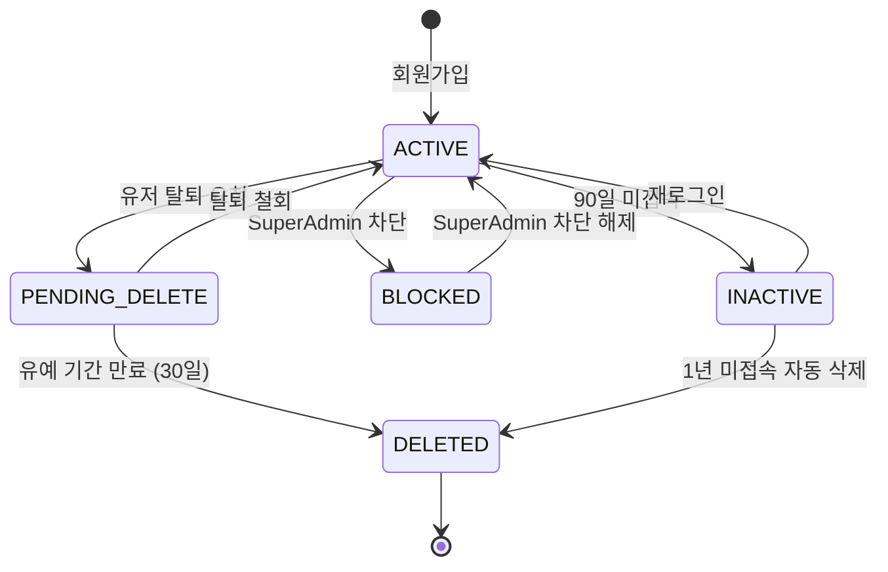

**차단 프로세스:**
1. SuperAdmin이 유저 선택 후 "차단" 클릭
2. 차단 사유 입력 (필수) - 드롭다운 + 자유 입력
   - 이용약관 위반
   - 비정상 트래픽
   - 결제 사기 의심
   - 기타 (직접 입력)
3. 차단 기간 선택 (1일 / 7일 / 30일 / 영구)
4. 확인 모달에서 최종 승인
5. 해당 유저에게 차단 알림 이메일 발송
6. 해당 유저의 모든 활성 세션 즉시 종료

#### 3.1.4 유저 카테고리 변경

SuperAdmin은 유저의 카테고리를 직접 변경할 수 있다.

**변경 프로세스:**
1. 유저 상세에서 카테고리 변경 버튼 클릭
2. 새 카테고리 선택 (B2C / 인하우스HR / 헤드헌터)
3. 변경 사유 입력
4. 확인 후 즉시 반영
5. 카테고리 변경에 따른 요금제/기능 제한 자동 조정
6. 유저에게 카테고리 변경 알림 발송

#### 3.1.5 유저 초대/생성

**초대 방식:**
- 이메일 초대: 초대 링크 포함된 이메일 발송
- 일괄 초대: CSV 파일 업로드로 대량 초대
- 직접 생성: SuperAdmin이 직접 계정 생성 (초기 비밀번호 자동 생성)

**초대 필수 정보:**
| 필드 | 필수 여부 | 설명 |
|---|:---:|---|
| 이메일 | 필수 | 유효한 이메일 주소 |
| 이름 | 필수 | 한글 또는 영문 이름 |
| 카테고리 | 필수 | B2C / 인하우스HR / 헤드헌터 |
| 초기 요금제 | 선택 | 미지정 시 Free |
| 소속 회사 | 선택 | 인하우스HR/헤드헌터 시 권장 |
| 역할 | 선택 | User(기본) / SuperAdmin |

---

### 3.2 트래픽 모니터링 & 이상 징후 탐지

#### 3.2.1 실시간 트래픽 대시보드

**상단 요약 카드 (MetricCard 패턴 재활용):**

| 메트릭 | 설명 | 시각화 |
|---|---|---|
| 현재 동시 접속자 | 30초 폴링 업데이트 (Phase 4 초기), 이후 SSE 전환 | 숫자 + SparkLine |
| 금일 총 API 호출 | 00:00부터 누적 | 숫자 + 전일 대비 증감 |
| 금일 평균 응답 시간 | ms 단위 | 숫자 + SparkLine |
| 활성 알림 | 미확인 이상 징후 수 | 숫자 + 심각도 색상 |

**실시간 트래픽 차트:**
- X축: 시간 (최근 1시간/6시간/24시간/7일 선택)
- Y축: 분당 요청 수 (RPM)
- 라인: 총 요청, 성공(2xx), 클라이언트 에러(4xx), 서버 에러(5xx)
- 임계값 라인 표시 (경고/위험)

**실시간 데이터 전략 (Phase 4):**

| 단계 | 방식 | 시점 |
|---|---|---|
| 1단계 | 30초 폴링 | Phase 4 초기 |
| 2단계 | SSE (Server-Sent Events) | Phase 4 중반 |
| 3단계 (선택) | WebSocket | Phase 6 이후 필요 시 |

**SSE 엔드포인트:** `GET /api/v1/admin/traffic/stream` (SuperAdmin 전용)

**Zustand Store SSE 상태:**
```typescript
interface TrafficStreamState {
  connectionStatus: 'connecting' | 'connected' | 'disconnected' | 'error';
  lastEventId: string | null;
  reconnectAttempts: number;
}
```

**엔드포인트별 트래픽 테이블:**

| 컬럼 | 설명 |
|---|---|
| Endpoint | API 엔드포인트 경로 |
| Method | GET/POST/PUT/DELETE |
| 호출 수 | 선택 기간 내 총 호출 수 |
| 평균 응답 시간 | ms 단위 |
| 에러율 | 4xx + 5xx 비율 |
| P95 응답 시간 | 95th percentile |

#### 3.2.2 이상 징후 알림 시스템

**탐지 규칙 (Detection Rules):**

| 규칙 ID | 규칙명 | 조건 | 심각도 |
|---|---|---|---|
| TR-001 | 급격한 트래픽 증가 | 직전 1시간 대비 RPM 300% 이상 증가 | WARNING |
| TR-002 | 비정상 대량 호출 | 단일 유저 분당 100회 이상 API 호출 | CRITICAL |
| TR-003 | 의심 스크레핑 패턴 | 순차적 Pagination 호출 (page=1,2,3...) + 짧은 간격 | WARNING |
| TR-004 | 높은 에러율 | 특정 엔드포인트 에러율 10% 초과 (5분 윈도우) | WARNING |
| TR-005 | 서버 에러 급증 | 5xx 에러 분당 50건 초과 | CRITICAL |
| TR-006 | 비정상 로그인 시도 | 동일 IP 5분 내 로그인 실패 10회 이상 | CRITICAL |
| TR-007 | 동시 다중 세션 | 동일 계정 서로 다른 IP에서 5개 이상 세션 | WARNING |
| TR-008 | 비정상 시간대 대량 접근 | 새벽 2-5시 사이 평소 대비 500% 트래픽 | WARNING |
| TR-009 | 데이터 대량 Export | 단일 유저 1시간 내 Export 10회 이상 | WARNING |

**알림 채널:**

| 채널 | 대상 | 조건 |
|---|---|---|
| 대시보드 인앱 알림 | SuperAdmin | 모든 알림 |
| 이메일 | SuperAdmin | WARNING 이상 |
| Slack Webhook | #ops-alert 채널 | CRITICAL만 |

**알림 관리 UI:**
- 알림 목록 (필터: 심각도, 상태, 기간)
- 알림 상세: 발생 시각, 관련 유저, 관련 엔드포인트, 트래픽 스냅샷
- 상태 변경: 미확인 -> 확인 -> 해결 -> 무시(허용)
- 규칙 편집: 임계값 조정, 활성/비활성 토글

#### 3.2.3 API 호출 빈도 분석

**유저별 호출 분석:**
- 상위 호출 유저 Top 20 테이블
- 유저별 시간대별 호출 히트맵
- 유저별 엔드포인트 사용 분포 (Pie/Bar Chart)
- 유저별 일일/주간/월간 호출 추이

**엔드포인트별 분석:**
- 인기 엔드포인트 랭킹
- 엔드포인트별 평균 응답 시간 추이
- 엔드포인트별 에러율 추이

#### 3.2.4 스크레핑 패턴 탐지

**탐지 시그널:**

| 시그널 | 가중치 | 설명 |
|---|---|---|
| 순차 Pagination | 높음 | page=1, 2, 3... 순서대로 빠르게 호출 |
| 짧은 호출 간격 | 높음 | 평균 요청 간격 < 1초 |
| 동일 User-Agent | 중간 | 브라우저가 아닌 스크립트 User-Agent |
| 비정상 시간대 | 중간 | 새벽 시간 대량 요청 |
| 쿠키 미사용 | 낮음 | 세션 쿠키 없는 API 호출 |
| Headless 브라우저 | 높음 | Puppeteer/Playwright 등 탐지 |

**대응 자동화:**
- 경고 단계: 해당 유저 Rate Limit 50%로 자동 축소
- 위험 단계: 해당 유저 일시 차단 (SuperAdmin 수동 해제 필요)
- 차단 단계: IP + 계정 동시 차단

#### 3.2.5 IP 기반 분석

- 유저별 접속 IP 이력
- IP 지오로케이션 맵 (세계 지도 시각화)
- 동일 IP 다중 계정 사용 탐지
- VPN/Proxy/Tor 사용 탐지 플래그
- IP 허용/차단 목록 (Whitelist/Blacklist) 관리

---

### 3.3 과금/빌링 관리

#### 3.3.1 요금제 설정

| 요금제 | 대상 | 월 요금 | 연 요금 (할인 적용) | 주요 기능 |
|---|---|---|---|---|
| **Free** | 모든 카테고리 | 0원 | 0원 | 기본 분석 뷰, 일 100회 API, Export 불가 |
| **Basic** | B2C, 인하우스HR | 49,000원/월 | 499,000원/년 (약 15% 할인) | 전체 분석 뷰, 일 500회 API, CSV Export |
| **Pro** | 인하우스HR, 헤드헌터 | 149,000원/월 | 1,499,000원/년 (약 16% 할인) | 전체 분석 뷰, 일 2,000회 API, Excel Export, 이력서 매칭 |
| **Enterprise** | 인하우스HR, 헤드헌터 | 별도 협의 | 별도 협의 | 무제한 API, 전용 지원, 커스텀 리포트, API 키 발급 |

**요금제 관리 UI:**
- 요금제 목록 (카드 형태)
- 요금제별 기능 비교 매트릭스
- 요금제 생성/수정/비활성화 (삭제 불가, 비활성만 가능)
- 요금제별 현재 가입자 수 표시

**요금제 세부 설정:**

| 설정 항목 | 설명 |
|---|---|
| 요금제명 | 표시용 이름 |
| 요금제 코드 | 시스템 식별자 (예: `plan_pro`) |
| 월 요금 | 원 단위 |
| 연 요금 | 원 단위 (연간 결제 시 15-20% 할인) |
| API 일일 한도 | 호출 횟수 |
| API 월간 한도 | 호출 횟수 |
| Export 허용 여부 | CSV / Excel / PDF |
| 허용 기능 목록 | 분석 뷰, 이력서 매칭 등 |
| 적용 카테고리 | B2C / 인하우스HR / 헤드헌터 |

#### 3.3.2 유저별 사용량 추적

**사용량 대시보드:**
- 전체 유저 사용량 요약 (총 API 호출, 총 Export 건수, 총 매출)
- 요금제별 사용량 분포 (Stacked Bar Chart)
- 사용량 초과 유저 알림 목록
- 카테고리별 평균 사용량 비교

**개별 유저 사용량:**
- 일별/주별/월별 API 호출 차트
- 기능별 사용 비율 (Pie Chart)
- 현재 사용량 / 한도 프로그레스 바
- 사용량 초과 이력

#### 3.3.3 청구서 생성/관리

**청구 주기:**
- 월간 정기 결제 (매월 1일 자동 청구)
- 연간 정기 결제 (가입월 1일 자동 청구)
- 수동 청구 (Enterprise 요금제)

**청구서 정보:**

| 필드 | 설명 |
|---|---|
| 청구서 번호 | 자동 생성 (`INV-YYYYMM-XXXXX`) |
| 발행일 | 청구서 생성일 |
| 결제 마감일 | 발행일 + 7일 |
| 유저 정보 | 이름, 이메일, 회사명 |
| 요금제 | 요금제명 + 기간 |
| 기본 요금 | 요금제 월/연 요금 |
| 추가 요금 | API 초과 사용분 등 |
| 할인/크레딧 | 적용된 할인 내역 |
| 총 청구 금액 | 최종 결제 금액 |
| 결제 상태 | 대기 / 결제완료 / 결제실패 / 환불 |

**청구서 관리 UI:**
- 청구서 목록 (필터: 기간, 상태, 유저, 요금제)
- 청구서 상세 보기 / PDF 다운로드
- 수동 청구서 생성 (Enterprise)
- 결제 실패 건 재청구
- 환불 처리

#### 3.3.4 결제 이력 조회

- 전체 결제 내역 테이블 (날짜, 유저, 금액, 결제 수단, 상태)
- 월별 매출 추이 차트 (Area Chart)
- 요금제별 매출 분포 (Donut Chart)
- 결제 성공률 / 실패율
- 환불 내역 및 환불 사유 통계

#### 3.3.5 할인/크레딧 관리

**할인 유형:**

| 유형 | 설명 | 적용 방식 |
|---|---|---|
| 쿠폰 | 일회성 할인 코드 | 금액 차감 또는 비율 할인 |
| 프로모션 | 기간 한정 할인 | 특정 기간 요금 할인 |
| 크레딧 | 잔액 형태 | 결제 시 자동 차감 |
| 파트너 할인 | 제휴사 할인 | 요금제 단위 할인 |
| 연간 결제 할인 | 연간 결제 시 자동 적용 | 15-20% 할인 |

**크레딧 관리:**
- 유저별 크레딧 잔액 조회
- 크레딧 수동 충전/차감
- 크레딧 사용 이력
- 크레딧 만료 정책 (충전일 기준 1년)

#### 3.3.6 한국 결제 특수 요구사항

| 항목 | 설명 | 구현 시점 |
|---|---|---|
| **세금계산서 자동 발행** | 사업자 유저(인하우스HR, 헤드헌터)에 대해 결제 완료 시 세금계산서 자동 발행. 국세청 연동 또는 PG사 부가서비스 활용 | Phase 3 |
| **현금영수증 발행** | 계좌이체/가상계좌 결제 시 현금영수증 자동 발행. 소득공제용/지출증빙용 선택 | Phase 3 |
| **정기결제 빌링키 갱신 실패** | 카드 만료/한도 초과 등으로 빌링키 결제 실패 시 **7일 Grace Period** 부여. D+1, D+3, D+5에 자동 재시도. Grace Period 내 결제 수단 변경 유도 알림 발송 | Phase 3 |
| **PG사 심사 요건** | 사업자등록증, 통신판매업 신고증, 서비스 URL, 이용약관/개인정보처리방침 준비. 심사 기간 2-4주 감안하여 Phase 3 시작 전 신청 | Phase 3 사전 |
| **연간 결제 할인** | 연간 결제 시 15-20% 할인 자동 적용. 월간 -> 연간 전환 시 잔여 월 비용 일할 계산 | Phase 3 |

---

### 3.4 유저 카테고리 관리

#### 3.4.1 카테고리 정의

##### B2C (개인 채용 정보 탐색자)

| 항목 | 설명 |
|---|---|
| **대상** | 구직자, 커리어 전환 고려자, 채용 시장 관심자 |
| **주요 사용 기능** | 채용 트렌드, 기업 분석, 이력서 매칭(Pro) |
| **데이터 접근** | 기본적 시장 데이터, 개인화 추천 |
| **허용 요금제** | Free, Basic |
| **특수 기능** | 관심 기업 북마크, 이직 알림 설정 |

##### 인하우스HR (기업 내부 채용담당자)

| 항목 | 설명 |
|---|---|
| **대상** | 기업 인사팀, TA(Talent Acquisition) 팀 |
| **주요 사용 기능** | 전체 분석 뷰, 경쟁사 채용 분석, 인재풀 분석 |
| **데이터 접근** | 시장 벤치마크 데이터, 경쟁사 비교 |
| **허용 요금제** | Free, Basic, Pro, Enterprise |
| **특수 기능** | 경쟁사 채용 알림, 팀 계정 관리(Enterprise) |

##### 헤드헌터 (서치펌/헤드헌팅 에이전시)

| 항목 | 설명 |
|---|---|
| **대상** | 서치펌, 헤드헌팅 에이전시, 프리랜서 리크루터 |
| **주요 사용 기능** | 전체 분석 뷰, 이력서 매칭, 기업 분석 심화 |
| **데이터 접근** | 시장 전체 데이터, 인재 이동 흐름 |
| **허용 요금제** | Free, Pro, Enterprise |
| **특수 기능** | 다중 기업 비교, 인재 매칭 리포트, 대량 Export |

#### 3.4.2 카테고리별 기능 제한 설정

SuperAdmin이 각 카테고리별로 기능 접근 권한을 세밀하게 조정할 수 있는 설정 UI:

```
카테고리 기능 제한 설정
├── B2C
│   ├── [x] Top 채용 볼륨 조회
│   ├── [x] SD 매트릭스 조회
│   ├── [x] 시계열 인텔리전스
│   ├── [x] 채용 트렌드
│   ├── [ ] 이력서 매칭 (Pro 이상)
│   ├── [x] 기업 분석 (기본)
│   └── [ ] 기업 분석 (상세 - 인재흐름)
├── 인하우스HR
│   ├── [x] 모든 분석 뷰
│   ├── [x] 이력서 매칭 (Pro 이상)
│   ├── [x] 경쟁사 비교 분석
│   └── [ ] 팀 계정 (Enterprise)
└── 헤드헌터
    ├── [x] 모든 분석 뷰
    ├── [x] 이력서 매칭
    ├── [x] 대량 Export (Pro 이상)
    └── [ ] API 키 발급 (Enterprise)
```

#### 3.4.3 카테고리별 요금 정책

카테고리 변경 시 자동으로 적용되는 요금 정책:

| 전환 시나리오 | 처리 방식 |
|---|---|
| B2C -> 인하우스HR | 기존 요금제 유지, 인하우스HR 전용 기능 활성화 |
| B2C -> 헤드헌터 | Free 유저는 유지, Basic 유저는 Pro 권장 안내 |
| 인하우스HR -> 헤드헌터 | 요금제 유지, 기능 접근 자동 조정 |
| 헤드헌터 -> B2C | 다운그레이드 경고, 30일 유예 후 기능 제한 |

---

### 3.5 Google Analytics 연동

#### 3.5.1 GA4 이벤트 트래킹 설계

GA4 연동은 별도 섹션 7에서 상세히 다룬다. 본 섹션에서는 SuperAdmin 대시보드에 표시할 GA 데이터 뷰를 정의한다.

#### 3.5.2 주요 KPI 대시보드

**실시간 메트릭 카드:**

| KPI | 설명 | 데이터 소스 |
|---|---|---|
| DAU (Daily Active Users) | 일일 활성 사용자 수 | GA4 |
| WAU (Weekly Active Users) | 주간 활성 사용자 수 | GA4 |
| MAU (Monthly Active Users) | 월간 활성 사용자 수 | GA4 |
| 평균 세션 시간 | 유저당 평균 체류 시간 | GA4 |
| 이탈률 (Bounce Rate) | 단일 페이지 방문 후 이탈 비율 | GA4 |
| 신규 가입자 수 | 금일/금주/금월 신규 가입 | 내부 DB |
| 전환율 (Free->Paid) | 무료에서 유료 전환 비율 | 내부 DB + GA4 |

**추이 차트:**
- DAU/WAU/MAU 추이 (최근 6개월, Area Chart)
- 카테고리별 사용자 분포 추이 (Stacked Area)
- 신규 vs 재방문 비율 추이 (Line Chart)

#### 3.5.3 사용자 행동 분석

**기능별 사용 빈도:**
- 각 분석 뷰의 일별/주별 사용 횟수
- 기능별 평균 체류 시간
- 기능 간 이동 패턴 (Sankey Diagram)

**사용자 여정 분석:**
- 주요 사용자 흐름 (Top User Flows)
- 이탈 지점 분석 (Exit Pages)
- 첫 방문 후 활성화까지의 단계별 전환율

#### 3.5.4 페이지별 트래픽 분석

| 메트릭 | 설명 |
|---|---|
| 페이지뷰 | 각 페이지의 조회 수 |
| 고유 페이지뷰 | 유니크 세션 기준 조회 수 |
| 평균 체류 시간 | 페이지별 평균 머무른 시간 |
| 진입률 | 해당 페이지로 처음 진입한 비율 |
| 이탈률 | 해당 페이지에서 사이트를 떠난 비율 |

#### 3.5.5 전환 퍼널 분석

**핵심 퍼널:**

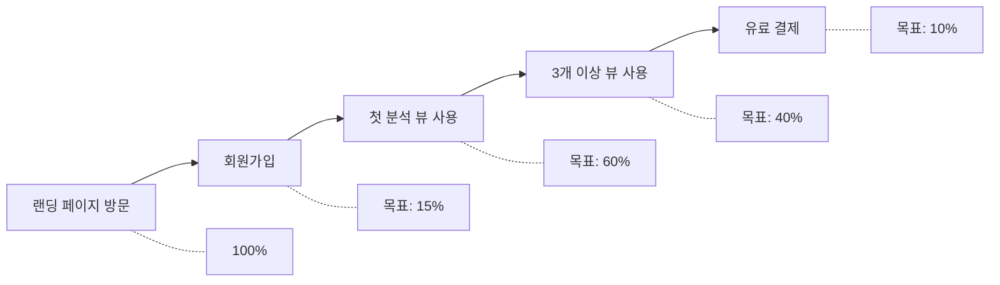

**추적 퍼널 목록:**
1. 가입 퍼널: 방문 -> 가입 페이지 -> 가입 완료
2. 활성화 퍼널: 가입 -> 첫 기능 사용 -> 재방문
3. 결제 퍼널: 요금제 페이지 조회 -> 결제 시작 -> 결제 완료
4. 리텐션 퍼널: D1 재방문 -> D7 재방문 -> D30 재방문

---

### 3.6 데이터 접근 (Pagination 제한 해제)

#### 3.6.1 무제한 페이지네이션

SuperAdmin 계정은 모든 데이터 목록에서 페이지네이션 제한이 해제된다:

| 기능 | 일반 유저 | SuperAdmin |
|---|---|---|
| 기업 랭킹 조회 | 최대 100위 | 전체 |
| 채용 공고 목록 | 최대 500건 | 전체 |
| 시계열 데이터 | 최근 52주 | 전체 기간 |
| 검색 결과 | 최대 200건 | 전체 |
| Export 건수 | 최대 1,000행 | 전체 |

**구현 방식:**
- 서버는 JWT payload의 `role` claim으로 pagination 제한을 결정한다
- SuperAdmin role인 경우 서버 측에서 Pagination Limit을 해제
- 대량 데이터 요청 시 스트리밍 응답 또는 비동기 Export

#### 3.6.2 전체 데이터 엑스포트

**지원 포맷:**
- CSV (UTF-8 BOM 포함, Excel 한글 호환)
- Excel (.xlsx, 서식 포함)
- JSON (API 연동용)
- PDF (리포트 형태)

**Export 프로세스:**
1. 데이터 범위 선택 (필터 조건 유지)
2. Export 포맷 선택
3. 대량 데이터의 경우 비동기 처리 (이메일 알림)
4. Export 이력 관리 (누가, 언제, 무엇을)

#### 3.6.3 Raw 데이터 조회

SuperAdmin 전용 Raw Data Explorer:
- SQL-like 쿼리 인터페이스 (읽기 전용)
- 사전 정의된 쿼리 템플릿
- 쿼리 결과 시각화 (테이블/차트 전환)
- 쿼리 이력 저장 및 공유

---

## 4. User(일반 사용자) 대시보드 기능 명세

### 4.1 내 프로필 & 카테고리

#### 4.1.1 프로필 정보 관리

**조회/수정 가능 필드:**

| 필드 | 수정 가능 | 비고 |
|---|:---:|---|
| 프로필 이미지 | O | 최대 2MB, JPG/PNG |
| 이름 | O | |
| 이메일 | X | 변경 시 인증 필요 (별도 플로우) |
| 전화번호 | O | 선택 사항 |
| 소속 회사 | O | 인하우스HR/헤드헌터 시 필수 |
| 직무/직함 | O | 선택 사항 |
| 비밀번호 | O | 현재 비밀번호 확인 필요 |

**이메일 변경 플로우:**
1. 새 이메일 입력
2. 현재 비밀번호 확인
3. 새 이메일로 인증 코드 발송
4. 인증 코드 입력 후 변경 완료
5. 기존 이메일로 변경 알림 발송

#### 4.1.2 내 유저 카테고리 확인/변경 요청

**현재 카테고리 표시:**
- 카테고리명 + 설명
- 카테고리별 혜택 요약
- 현재 카테고리에서 이용 가능한 기능 목록

**카테고리 변경 요청:**
1. "카테고리 변경 요청" 버튼 클릭
2. 변경 희망 카테고리 선택
3. 변경 사유 입력 (필수)
4. 증빙 서류 업로드 (선택)
   - 인하우스HR: 재직증명서, 명함 사진
   - 헤드헌터: 사업자등록증, 서치펌 재직증명
5. 요청 접수 후 SuperAdmin 승인 대기
6. 승인/거부 결과 이메일 알림

**변경 요청 상태:**
- `PENDING` - 심사 대기 중
- `APPROVED` - 승인 완료
- `REJECTED` - 거부 (사유 포함)

---

### 4.2 결제 관리

#### 4.2.1 현재 요금제 확인

**표시 정보:**
- 현재 요금제명 + 월/연간 여부
- 다음 결제일
- 이번 달 사용량 (API 호출 / 한도)
- 요금제별 기능 잠금/해제 상태 시각화

**요금제 비교 UI:**
- 전체 요금제 비교 카드 (현재 요금제 하이라이트)
- 기능별 상세 비교 테이블
- "업그레이드" / "다운그레이드" CTA 버튼

#### 4.2.2 결제 수단 관리

**지원 결제 수단:**

| 결제 수단 | 설명 |
|---|---|
| 신용/체크카드 | PG사 연동 (토스페이먼츠 / NHN KCP) |
| 계좌이체 | 가상계좌 발급 |
| 카카오페이 | 간편결제 |
| 네이버페이 | 간편결제 |

**결제 수단 관리 UI:**
- 등록된 결제 수단 목록 (카드 번호 마스킹: `**** **** **** 1234`)
- 기본 결제 수단 지정
- 결제 수단 추가/삭제
- 결제 수단 변경 시 다음 결제부터 적용

#### 4.2.3 결제 이력 조회

| 컬럼 | 설명 |
|---|---|
| 결제일 | YYYY-MM-DD HH:mm |
| 요금제 | 결제 당시 요금제 |
| 결제 금액 | 원 단위 |
| 결제 수단 | 카드/간편결제 등 |
| 상태 | 결제완료 / 결제실패 / 환불 |
| 영수증 | PDF 다운로드 링크 |

- 기간 필터 (최근 3개월 / 6개월 / 1년 / 전체)
- 결제 실패 건 재결제 버튼
- 세금계산서 발행 요청 (사업자용)
- 현금영수증 발행 요청 (계좌이체/가상계좌 결제 시)

#### 4.2.4 요금제 변경/업그레이드

**업그레이드:**
1. 원하는 요금제 선택
2. 변경 사항 미리보기 (추가 비용, 새 기능)
3. 일할 계산 안내 (남은 기간 기준)
4. 결제 진행
5. 즉시 적용

**다운그레이드:**
1. 원하는 요금제 선택
2. 제한될 기능 안내 (경고)
3. 현재 결제 주기 종료 후 적용
4. 다운그레이드 예약 확인

**해지(Free로 전환):**
1. 해지 사유 수집
2. 현재 결제 주기 종료 후 Free 전환
3. 유료 기능 사용 불가 예고 안내
4. 해지 철회 가능 기간 안내

---

### 4.3 회원 탈퇴

#### 4.3.1 탈퇴 프로세스

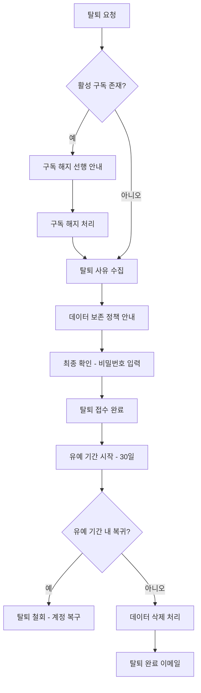

#### 4.3.2 탈퇴 사유 수집

**사전 정의 사유 (복수 선택 가능):**

| 코드 | 사유 |
|---|---|
| `REASON_PRICE` | 가격이 비쌈 |
| `REASON_UNUSED` | 서비스를 거의 사용하지 않음 |
| `REASON_ALTERNATIVE` | 대체 서비스 이용 |
| `REASON_FEATURE` | 필요한 기능이 없음 |
| `REASON_UX` | 사용이 불편함 |
| `REASON_QUALITY` | 데이터 품질 불만 |
| `REASON_PERSONAL` | 개인 사정 |
| `REASON_OTHER` | 기타 (직접 입력) |

- 자유 텍스트 입력 필드 (선택, 최대 500자)
- 탈퇴 사유 통계는 SuperAdmin 대시보드에서 확인 가능

#### 4.3.3 데이터 보존 정책

| 데이터 유형 | 유예 기간 중 | 탈퇴 완료 후 | 법적 보존 기간 |
|---|---|---|---|
| 계정 정보 (이메일, 이름) | 보존 | 익명화 | 탈퇴 후 30일 |
| 프로필 정보 | 보존 | 삭제 | - |
| 결제 이력 | 보존 | 보존 | 5년 (전자상거래법) |
| 활동 로그 | 보존 | 익명화 | 3개월 (통신비밀보호법) |
| 검색 히스토리 | 보존 | 삭제 | - |
| 저장된 설정 | 보존 | 삭제 | - |

**유저에게 안내할 내용:**
- 30일 유예 기간 동안 로그인하면 탈퇴 철회 가능
- 결제 이력은 법적 의무에 의해 5년간 보존
- 탈퇴 완료 후 동일 이메일로 재가입 가능 (기존 데이터 미복구)

#### 4.3.4 탈퇴 유예 기간

- **기간**: 탈퇴 요청일로부터 30일
- **유예 기간 중 제한**: 로그인 가능하나, 서비스 이용 불가 (탈퇴 철회 유도)
- **탈퇴 철회**: 유예 기간 내 로그인 시 "탈퇴 철회하시겠습니까?" 모달 표시
- **자동 삭제**: 유예 기간 만료 시 배치 작업으로 데이터 삭제/익명화 처리
- **알림**: 유예 기간 중 D+7, D+14, D+25에 탈퇴 철회 안내 이메일 발송

---

### 4.4 사용 분석

#### 4.4.1 내가 자주 본 메뉴/기능

**시각화:**
- 기능별 사용 횟수 Bar Chart (상위 10개)
- 최근 30일 기능 사용 히트맵 (요일 x 시간)
- 주간 사용 추이 Line Chart

**표시 항목:**
| 기능 | 이번 주 사용 | 지난 주 대비 | 전체 기간 누적 |
|---|---|---|---|
| Top 채용 볼륨 | 12회 | +20% | 156회 |
| SD 매트릭스 | 8회 | -10% | 89회 |
| ... | ... | ... | ... |

#### 4.4.2 검색 히스토리

- 최근 검색어 목록 (최대 100건)
- 검색어 삭제 (개별/전체)
- 자주 검색하는 키워드 Word Cloud
- 검색 결과 클릭 이력

#### 4.4.3 활동 타임라인

최근 활동을 시간순으로 표시하는 타임라인:

```
2026-03-20
  14:30  기업 분석 뷰에서 '삼성전자' 상세 조회
  14:15  이력서 매칭 실행 (매칭 결과 8건)
  13:45  채용 트렌드 뷰 접속
  10:00  로그인

2026-03-19
  16:20  Top 채용 볼륨 - CSV Export
  15:00  SD 매트릭스 조회
  09:30  로그인
```

**필터:**
- 활동 유형: 로그인, 뷰 조회, 검색, Export, 설정 변경
- 기간: 오늘, 최근 7일, 최근 30일, 커스텀

#### 4.4.4 사용량 통계

- 이번 달 API 호출 현황 (프로그레스 바 + 숫자)
- 일별 API 호출 추이 (Bar Chart)
- 요금제 한도 대비 사용 비율
- 한도 초과 예상일 알림
- Export 사용 현황

---

## 5. 기술 아키텍처

### 5.1 현재 시스템 분석

**현재 기술 스택:**

| 레이어 | 기술 | 버전 |
|---|---|---|
| UI Framework | React | 19.2.4 |
| Language | TypeScript | 5.9.3 |
| Build Tool | Vite | 8.0.0 |
| Styling | Tailwind CSS | 4.2.1 |
| Charts | Recharts | 3.8.0 |
| 라우팅 | 없음 (useState 탭) | - |
| 상태관리 | 없음 (로컬 state) | - |
| 인증 | 없음 (Mock 모달) | - |
| 백엔드 | 없음 (하드코딩 데이터) | - |

**현재 디렉토리 구조:**

```
src/
├── App.tsx                          # 메인 앱 (탭 네비게이션)
├── main.tsx                         # 엔트리포인트
├── index.css                        # 글로벌 스타일
├── assets/                          # 정적 에셋
├── components/
│   ├── views/                       # 6개 분석 뷰
│   │   ├── SDMatrixView.tsx
│   │   ├── TopCompaniesView.tsx
│   │   ├── CompanyTimelineView.tsx
│   │   ├── HiringTrendsView.tsx
│   │   ├── ResumeMatchView.tsx
│   │   └── CompanyAnalysisView.tsx
│   ├── charts/
│   │   └── TreeMapChart.tsx
│   └── common/                      # 공통 컴포넌트
│       ├── MetricCard.tsx
│       ├── DrilldownPanel.tsx
│       ├── InlineSparkBar.tsx
│       ├── SparkBars.tsx
│       ├── SubIndexBar.tsx
│       ├── SDDataTable.tsx
│       └── TalentFlowChart.tsx
├── data/                            # Mock 데이터
│   ├── companies.ts
│   ├── companyProfiles.ts
│   ├── industries.ts
│   ├── keywordMap.ts
│   ├── resume.ts
│   ├── segments.ts
│   ├── timeline.ts
│   └── trends.ts
└── types/
    └── index.ts                     # 타입 정의
```

### 5.2 목표 아키텍처

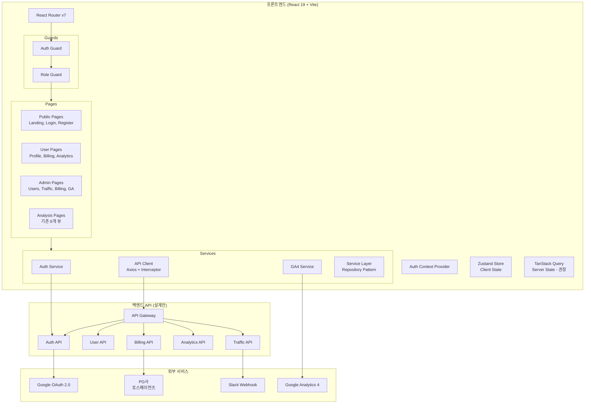

### 5.3 프론트엔드 아키텍처

#### 5.3.1 React Router 도입

**라우트 구조:**

```
/                              # 랜딩 (Guest 가능)
/login                         # 로그인
/register                      # 회원가입
/register/category             # 카테고리 선택
/forgot-password               # 비밀번호 찾기

/dashboard                     # 메인 대시보드 (기존 탭 뷰 통합)
/dashboard/top-companies       # Top 채용 볼륨
/dashboard/sd-matrix           # 수요공급 매트릭스
/dashboard/timeline            # 시계열 인텔리전스
/dashboard/trends              # 채용 트렌드
/dashboard/resume-match        # 이력서 매칭
/dashboard/company-analysis    # 기업 분석

/my                            # User 대시보드
/my/profile                    # 내 프로필
/my/billing                    # 결제 관리
/my/billing/plans              # 요금제 비교/변경
/my/billing/history            # 결제 이력
/my/billing/payment-methods    # 결제 수단 관리
/my/analytics                  # 사용 분석
/my/analytics/usage            # 사용량 통계
/my/analytics/history          # 활동 타임라인
/my/analytics/search           # 검색 히스토리
/my/settings                   # 설정
/my/delete-account             # 회원 탈퇴

/admin                         # SuperAdmin 대시보드
/admin/users                   # 유저 관리
/admin/users/:id               # 유저 상세
/admin/traffic                 # 트래픽 모니터링
/admin/traffic/realtime        # 실시간 트래픽
/admin/traffic/alerts          # 이상 징후 알림
/admin/traffic/scraping        # 스크레핑 탐지
/admin/traffic/ip              # IP 분석
/admin/billing                 # 과금 관리
/admin/billing/plans           # 요금제 관리
/admin/billing/invoices        # 청구서 관리
/admin/billing/credits         # 할인/크레딧
/admin/billing/revenue         # 매출 분석
/admin/categories              # 카테고리 관리
/admin/ga                      # GA 대시보드
/admin/data                    # Raw 데이터 조회
/admin/settings                # 시스템 설정
```

#### 5.3.2 상태관리

**상태 분리 전략 (권장):**

| 상태 유형 | 라이브러리 | 용도 |
|---|---|---|
| **클라이언트 상태** | Zustand | 인증 정보, UI 상태 (사이드바 열림/닫힘, 테마), SSE 연결 상태 |
| **서버 상태** (권장) | TanStack Query (React Query) | 유저 목록, 청구서, 트래픽 데이터 등 API에서 가져오는 모든 데이터. 자동 캐싱, 리패칭, 낙관적 업데이트 제공 |

> **참고:** TanStack Query 도입은 권장 사항이며, 초기에는 Zustand만으로 구현 후 서버 상태가 복잡해지는 Phase 2 이후에 점진적으로 도입할 수 있다.

**Zustand Store 구조 (클라이언트 상태):**

```typescript
// stores/authStore.ts
interface AuthState {
  user: User | null;
  accessToken: string | null;       // Memory only (Zustand store)
  isAuthenticated: boolean;
  role: UserRole;
  login: (credentials: LoginCredentials) => Promise<void>;
  logout: () => void;
  setAccessToken: (token: string) => void;
  clearAuth: () => void;
}

// stores/uiStore.ts
interface UIState {
  sidebarOpen: boolean;
  theme: 'light' | 'dark';
  toggleSidebar: () => void;
}

// stores/trafficStreamStore.ts
interface TrafficStreamState {
  connectionStatus: 'connecting' | 'connected' | 'disconnected' | 'error';
  lastEventId: string | null;
  reconnectAttempts: number;
}
```

**TanStack Query 사용 예시 (서버 상태, 권장):**

```typescript
// hooks/useUsers.ts
export function useUsers(params: UserListParams) {
  return useQuery({
    queryKey: ['admin', 'users', params],
    queryFn: () => adminApi.getUsers(params),
    staleTime: 30_000,
  });
}

// hooks/useInvoices.ts
export function useInvoices(params: InvoiceListParams) {
  return useQuery({
    queryKey: ['admin', 'invoices', params],
    queryFn: () => billingApi.getInvoices(params),
  });
}
```

#### 5.3.3 API 클라이언트

**인증 토큰 저장 전략:**

| 토큰 | 저장 위치 | 이유 |
|---|---|---|
| **Access Token** | Zustand store (JavaScript 메모리) | XSS 방어. 페이지 새로고침 시 소멸되므로 silent refresh로 복구 |
| **Refresh Token** | HttpOnly Secure SameSite Cookie | JavaScript에서 접근 불가. CSRF 방어 (SameSite=Strict) |

```typescript
// services/apiClient.ts
// Axios 기반, JWT 자동 주입 (메모리에서 읽기), Refresh Token 인터셉터

const apiClient = axios.create({
  baseURL: import.meta.env.VITE_API_BASE_URL,
  timeout: 30000,
  headers: { 'Content-Type': 'application/json' },
  withCredentials: true,  // Refresh Token 쿠키 자동 전송
});

// Request Interceptor: Zustand 메모리에서 Access Token 주입
apiClient.interceptors.request.use((config) => {
  const token = useAuthStore.getState().accessToken;
  if (token) {
    config.headers.Authorization = `Bearer ${token}`;
  }
  return config;
});

// Response Interceptor: 401 시 토큰 갱신, 실패 시 로그아웃
apiClient.interceptors.response.use(
  (response) => response,
  async (error) => {
    const originalRequest = error.config;
    if (error.response?.status === 401 && !originalRequest._retry) {
      originalRequest._retry = true;
      try {
        // /auth/refresh는 HttpOnly Cookie를 자동으로 전송
        // 서버는 Cookie에서 Refresh Token을 읽어 새 Access Token을 body로 반환
        const { data } = await axios.post(
          `${import.meta.env.VITE_API_BASE_URL}/api/v1/auth/refresh`,
          {},
          { withCredentials: true }
        );
        useAuthStore.getState().setAccessToken(data.data.accessToken);
        originalRequest.headers.Authorization = `Bearer ${data.data.accessToken}`;
        return apiClient(originalRequest);
      } catch (refreshError) {
        useAuthStore.getState().clearAuth();
        window.location.href = '/login';
        return Promise.reject(refreshError);
      }
    }
    return Promise.reject(error);
  }
);
```

**Silent Refresh (페이지 새로고침 시):**

```typescript
// App.tsx 또는 AuthProvider 내부
// 앱 초기화 시 /auth/refresh 호출하여 Access Token 복구
async function initializeAuth() {
  try {
    const { data } = await axios.post(
      `${import.meta.env.VITE_API_BASE_URL}/api/v1/auth/refresh`,
      {},
      { withCredentials: true }
    );
    useAuthStore.getState().setAccessToken(data.data.accessToken);
    useAuthStore.getState().setUser(data.data.user);
  } catch {
    // Refresh Token 없거나 만료 -> 미인증 상태 유지
    useAuthStore.getState().clearAuth();
  }
}
```

**Refresh Token 갱신 흐름:**

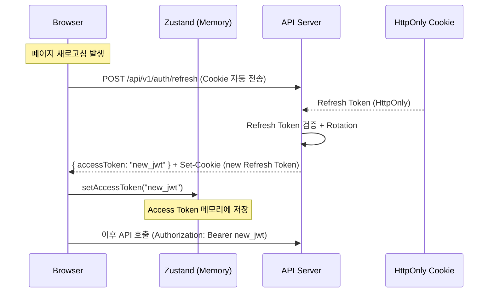

### 5.4 Mock API 전략 (Phase 1)

백엔드 API가 미구현된 상태에서 프론트엔드 개발을 진행하기 위해, **MSW (Mock Service Worker)**를 활용한 Mock API 전략을 도입한다.

#### 5.4.1 데이터 레이어 추상화

현재 `src/data/*.ts`에 하드코딩된 Mock 데이터를 **Service/Repository 패턴**으로 추상화하여, 실제 API 전환 시 최소한의 변경만으로 마이그레이션할 수 있도록 한다.

**마이그레이션 경로:**

```
Phase 1 초기          Phase 1 중반           Phase 1 후반           백엔드 준비 후
─────────────────     ─────────────────     ─────────────────     ─────────────────
Direct Import         Service Layer         MSW Mock API          Real API
(현재 방식)            (추상화)               (네트워크 레벨)        (실제 연동)

data/companies.ts     services/              msw/handlers/          services/
  → import directly     companyService.ts      auth.ts               (동일 인터페이스)
                        authService.ts         users.ts              apiClient 교체만
                        billingService.ts      billing.ts
```

**Service Layer 구조:**

```typescript
// services/userService.ts
interface UserService {
  getUsers(params: UserListParams): Promise<PaginatedList<User>>;
  getUserById(id: string): Promise<User>;
  updateUserStatus(id: string, status: UserStatus): Promise<User>;
}

// 현재 (Phase 1 초기): Mock 데이터 직접 반환
class MockUserService implements UserService {
  async getUsers(params) { /* src/data에서 필터링 후 반환 */ }
}

// 이후 (백엔드 연동 후): API 호출
class ApiUserService implements UserService {
  async getUsers(params) { return apiClient.get('/admin/users', { params }); }
}
```

#### 5.4.2 MSW 설정

```typescript
// msw/handlers/auth.ts
import { http, HttpResponse } from 'msw';

export const authHandlers = [
  http.post('/api/v1/auth/login', async ({ request }) => {
    const { email, password } = await request.json();
    // Mock 인증 로직
    return HttpResponse.json({
      status: 'success',
      data: { accessToken: 'mock_jwt_token', user: mockUser }
    });
  }),

  http.post('/api/v1/auth/refresh', () => {
    return HttpResponse.json({
      status: 'success',
      data: { accessToken: 'new_mock_jwt_token', user: mockUser }
    });
  }),
];

// msw/browser.ts
import { setupWorker } from 'msw/browser';
import { authHandlers } from './handlers/auth';
import { userHandlers } from './handlers/users';

export const worker = setupWorker(...authHandlers, ...userHandlers);

// main.tsx (개발 환경에서만 활성화)
if (import.meta.env.DEV) {
  const { worker } = await import('./msw/browser');
  await worker.start({ onUnhandledRequest: 'bypass' });
}
```

### 5.5 인증/인가 시스템

#### 5.5.1 JWT (JSON Web Token) 설계

**Access Token:**

| 항목 | 값 |
|---|---|
| 알고리즘 | RS256 |
| 만료 시간 | 15분 |
| 저장 위치 | Zustand store (JavaScript 메모리) |
| Payload | `{ sub, email, role, category, iat, exp }` |

**Refresh Token:**

| 항목 | 값 |
|---|---|
| 만료 시간 | 7일 (Remember Me: 30일) |
| 저장 위치 | HttpOnly Secure SameSite Cookie |
| 갱신 전략 | Rotation (사용 시 새 토큰 발급, 기존 무효화) |

**`/api/v1/auth/refresh` 흐름:**
1. 클라이언트가 `POST /api/v1/auth/refresh` 호출 (body 없음, Cookie 자동 전송)
2. 서버가 HttpOnly Cookie에서 Refresh Token을 읽음
3. Refresh Token 유효성 검증 + DB에서 revoke 여부 확인
4. 새 Access Token을 Response Body로 반환
5. 새 Refresh Token을 Set-Cookie 헤더로 반환 (Rotation)
6. 기존 Refresh Token을 DB에서 무효화

#### 5.5.2 OAuth 2.0 (Google)

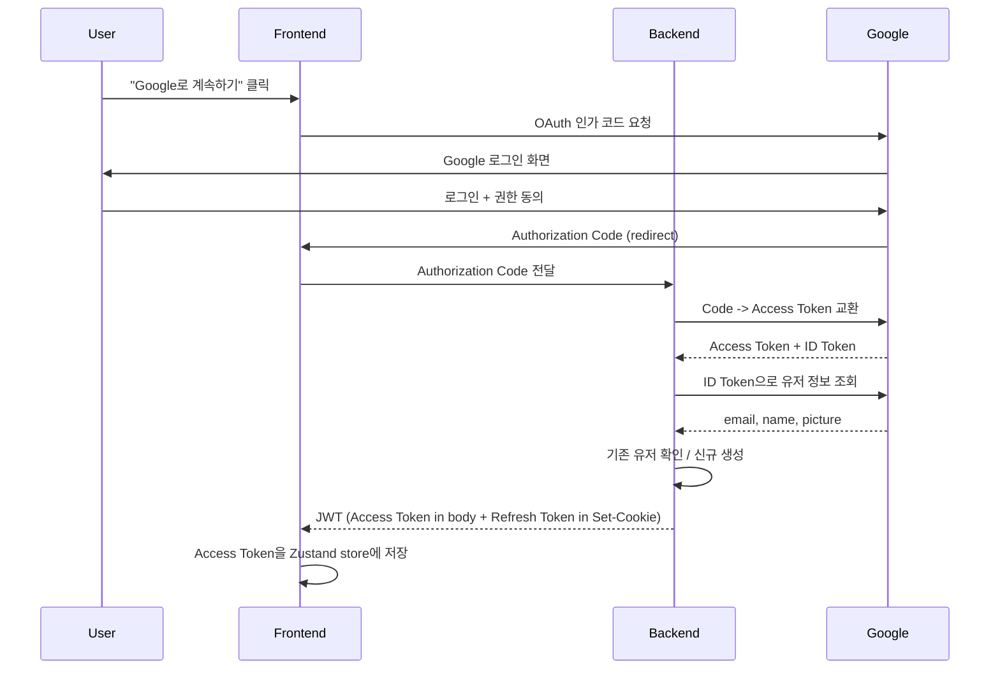

### 5.6 API 설계 방향

- **RESTful**: 리소스 기반 URL 설계, HTTP 메서드 활용
- **버전 관리**: URL Prefix 방식 (`/api/v1/`)
- **페이지네이션**: 엔드포인트별 전략 차등 적용 (아래 표 참조)
- **필터/정렬**: Query Parameter 방식 (`?sort=-createdAt&filter[status]=active`)
- **에러 형식**: 통일된 에러 응답 형식 (섹션 9.6 참조)
- **Rate Limiting**: 역할별 차등 적용, `X-RateLimit-*` 헤더 반환
- **Pagination 제한**: 서버가 JWT payload의 `role` claim으로 pagination 제한을 결정

**페이지네이션 전략:**

| 방식 | 대상 엔드포인트 | 이유 |
|---|---|---|
| **Cursor 기반** | `activity_logs`, `traffic_logs`, `alerts` | 시계열 대량 데이터. 일관된 정렬 보장, 중복/누락 방지 |
| **Offset 기반** | `users`, `invoices`, `plans`, `credits`, `search-history` | 관리 화면. 특정 페이지 직접 이동 필요, 데이터 변동 빈도 낮음 |

### 5.7 데이터베이스 스키마 개요

상세 스키마는 섹션 8에서 다루며, 여기서는 전체 구조만 기술한다.

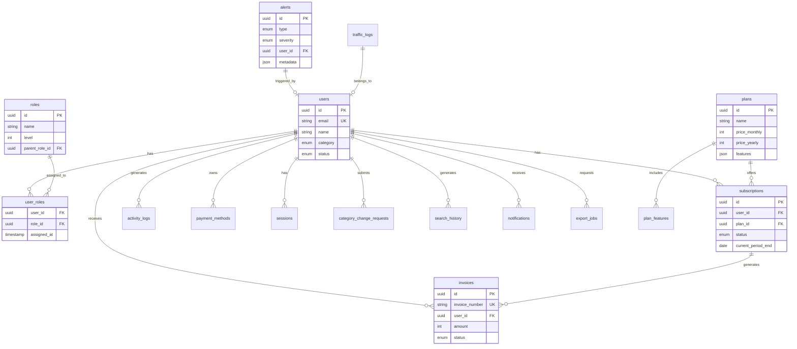

### 5.8 보안 고려사항

| 영역 | 대책 |
|---|---|
| **인증** | JWT RS256, Access Token in memory, Refresh Token in HttpOnly Cookie, Refresh Token Rotation |
| **인가** | 계층형 RBAC 미들웨어, 프론트엔드 Route Guard + 백엔드 이중 검증. JWT `role` claim 기반 서버 측 권한 판단 |
| **XSS** | React 기본 이스케이핑, CSP 헤더, DOMPurify (필요 시) |
| **CSRF** | SameSite Cookie, CSRF Token (폼 전송 시) |
| **SQL Injection** | ORM 사용 (Parameterized Query), Raw 쿼리 금지 |
| **Rate Limiting** | 역할별 차등 제한, IP 기반 + 유저 기반 이중 제한 |
| **데이터 암호화** | HTTPS 필수 (TLS 1.3), 민감 정보 DB 암호화 (AES-256) |
| **비밀번호** | bcrypt (cost factor 12), 최소 8자, 복잡도 정책 |
| **세션 관리** | 동시 세션 제한, 비정상 세션 강제 종료 |
| **감사 로그** | 관리자 액션 전수 로깅, 변경 불가 (append-only) |
| **PII 보호** | 개인정보 마스킹 (로그), 최소 수집 원칙 |

---

## 6. UI/UX 설계 가이드

### 6.1 네비게이션 구조

#### 6.1.1 전체 레이아웃

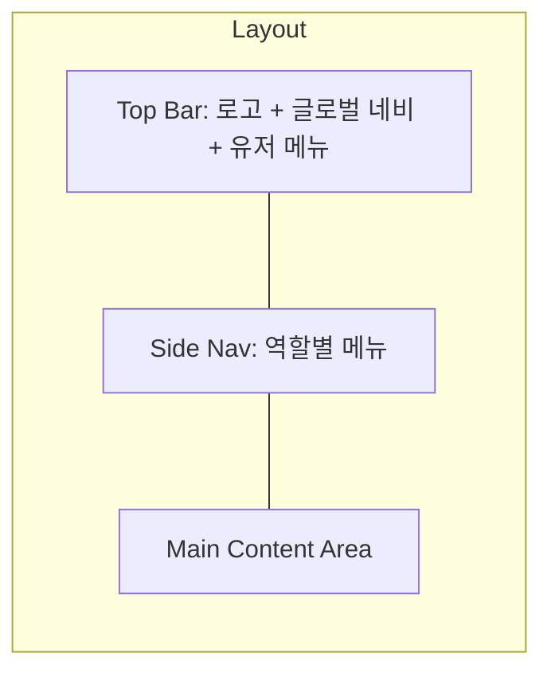

**변경 사항:** 현재 탭 기반 네비게이션에서 사이드바 + 탑바 레이아웃으로 전환.

#### 6.1.2 역할별 사이드바 메뉴

**Guest / 미로그인:**
```
채용 인텔리전스
├── Top 채용 볼륨
├── 수요공급 매트릭스
└── [잠금] 더 많은 기능을 보려면 로그인하세요
```

**User (일반 사용자):**
```
채용 인텔리전스
├── Top 채용 볼륨
├── 수요공급 매트릭스
├── 시계열 인텔리전스
├── 채용 트렌드
├── 이력서 매칭 [Pro]
└── 기업 분석

내 계정
├── 프로필
├── 결제 관리
├── 사용 분석
└── 설정
```

**SuperAdmin:**
```
채용 인텔리전스
├── (User와 동일)

내 계정
├── (User와 동일 - 권한 상속)

관리자 도구
├── 유저 관리
├── 트래픽 모니터링
│   ├── 실시간 트래픽
│   ├── 이상 징후 알림
│   ├── 스크레핑 탐지
│   └── IP 분석
├── 과금 관리
│   ├── 요금제 관리
│   ├── 청구서 관리
│   ├── 할인/크레딧
│   └── 매출 분석
├── 카테고리 관리
├── GA 대시보드
├── 데이터 조회
└── 시스템 설정
```

### 6.2 반응형 디자인

| Breakpoint | 너비 | 레이아웃 |
|---|---|---|
| Mobile | < 768px | 하단 탭 바 + 햄버거 메뉴, 사이드바 숨김 |
| Tablet | 768px - 1024px | 접힌 사이드바 (아이콘만) + 메인 콘텐츠 |
| Desktop | 1024px - 1440px | 펼쳐진 사이드바 + 메인 콘텐츠 |
| Wide | > 1440px | 사이드바 + 메인 콘텐츠 (max-width 제한) |

**반응형 원칙:**
- Mobile-first 접근
- 테이블은 모바일에서 카드 형태로 변환
- 차트는 가로 스크롤 또는 세로 배치로 전환
- 모달 대신 풀스크린 시트 (모바일)

### 6.3 디자인 시스템 컴포넌트

**기존 재활용 컴포넌트:**
- `MetricCard` - 상단 요약 메트릭 카드 (트래픽 대시보드 등에 재활용)
- `DrilldownPanel` - 상세 정보 슬라이드 패널
- `SparkBars` / `InlineSparkBar` - 인라인 차트
- `SDDataTable` - 데이터 테이블 기반 확장
- `SubIndexBar` - 세그먼트 바

**신규 필요 컴포넌트:**

| 컴포넌트 | 용도 |
|---|---|
| `SideNav` | 역할별 사이드바 네비게이션 |
| `TopBar` | 글로벌 헤더 (로고, 알림, 유저 메뉴) |
| `DataTable` | 범용 테이블 (정렬, 필터, 페이지네이션) |
| `StatusBadge` | 상태 뱃지 (Active, Blocked 등) |
| `CategoryBadge` | 카테고리 뱃지 (B2C, 인하우스HR, 헤드헌터) |
| `PlanBadge` | 요금제 뱃지 |
| `AlertCard` | 이상 징후 알림 카드 |
| `ProgressBar` | 사용량 프로그레스 바 |
| `EmptyState` | 데이터 없음 상태 |
| `ConfirmModal` | 확인/취소 모달 (차단, 탈퇴 등) |
| `FilterBar` | 범용 필터 바 (검색, 셀렉트, 날짜) |
| `Timeline` | 활동 타임라인 |
| `Heatmap` | 사용 히트맵 |
| `FunnelChart` | 전환 퍼널 차트 |

### 6.4 접근성 고려사항

| 항목 | 기준 | 구현 방안 |
|---|---|---|
| WCAG 레벨 | AA 준수 목표 | |
| 키보드 내비게이션 | 모든 인터랙션 키보드 접근 가능 | `tabIndex`, `onKeyDown` |
| 스크린 리더 | 의미 있는 콘텐츠 전달 | Semantic HTML, `aria-*` 속성 |
| 색상 대비 | 최소 4.5:1 (일반 텍스트) | Tailwind 색상 팔레트 검증 |
| 포커스 표시 | 명확한 포커스 인디케이터 | `focus-visible` 스타일 |
| 에러 안내 | 색상 외 추가 안내 | 아이콘 + 텍스트 병행 |
| 차트 접근성 | 데이터 테이블 대안 제공 | 차트 아래 접근 가능한 테이블 토글 |

---

## 7. GA4 이벤트 설계

### 7.1 추적할 이벤트 목록

#### 7.1.1 자동 수집 이벤트 (Enhanced Measurement)

| 이벤트 | 설명 |
|---|---|
| `page_view` | 페이지 조회 |
| `scroll` | 페이지 90% 스크롤 |
| `click` | 외부 링크 클릭 |
| `session_start` | 세션 시작 |
| `first_visit` | 최초 방문 |

#### 7.1.2 커스텀 이벤트

**인증 관련:**

| 이벤트명 | 트리거 | 파라미터 |
|---|---|---|
| `sign_up` | 회원가입 완료 | `method` (email/google), `category` |
| `login` | 로그인 성공 | `method` (email/google) |
| `login_failed` | 로그인 실패 | `method`, `error_type` |
| `logout` | 로그아웃 | - |
| `password_reset_request` | 비밀번호 재설정 요청 | - |

**기능 사용 관련:**

| 이벤트명 | 트리거 | 파라미터 |
|---|---|---|
| `view_analysis` | 분석 뷰 접근 | `view_name`, `view_id` |
| `search` | 검색 실행 | `search_term`, `result_count` |
| `filter_apply` | 필터 적용 | `filter_type`, `filter_value` |
| `data_export` | 데이터 Export | `format` (csv/excel/json), `row_count` |
| `resume_match` | 이력서 매칭 실행 | `match_count`, `top_score` |
| `company_detail_view` | 기업 상세 조회 | `company_name` |
| `drilldown_open` | Drilldown 패널 열기 | `source_view`, `target` |
| `chart_interact` | 차트 인터랙션 | `chart_type`, `action` (hover/click/zoom) |

**결제 관련:**

| 이벤트명 | 트리거 | 파라미터 |
|---|---|---|
| `view_pricing` | 요금제 페이지 조회 | - |
| `begin_checkout` | 결제 시작 | `plan_id`, `plan_name`, `value` |
| `purchase` | 결제 완료 | `plan_id`, `plan_name`, `value`, `currency` |
| `plan_upgrade` | 요금제 업그레이드 | `from_plan`, `to_plan` |
| `plan_downgrade` | 요금제 다운그레이드 | `from_plan`, `to_plan` |
| `subscription_cancel` | 구독 해지 | `plan_id`, `reason` |

**계정 관련:**

| 이벤트명 | 트리거 | 파라미터 |
|---|---|---|
| `profile_update` | 프로필 수정 | `updated_fields` |
| `category_change_request` | 카테고리 변경 요청 | `from_category`, `to_category` |
| `account_delete_request` | 탈퇴 요청 | `reason` |
| `account_delete_cancel` | 탈퇴 철회 | `days_before_deletion` |

### 7.2 Custom Dimensions

| Dimension 이름 | Scope | 설명 |
|---|---|---|
| `user_role` | User | SuperAdmin / User / Guest |
| `user_category` | User | B2C / 인하우스HR / 헤드헌터 |
| `subscription_plan` | User | Free / Basic / Pro / Enterprise |
| `company_name` | User | 소속 회사 (인하우스HR/헤드헌터) |
| `registration_method` | User | email / google |
| `analysis_view` | Event | 분석 뷰 이름 |
| `export_format` | Event | CSV / Excel / JSON / PDF |

### 7.3 전환 목표 설정

| 전환 목표 | 이벤트 | 우선순위 |
|---|---|---|
| 회원가입 완료 | `sign_up` | 높음 |
| 유료 결제 | `purchase` | 높음 |
| 요금제 업그레이드 | `plan_upgrade` | 높음 |
| 첫 분석 뷰 사용 | `view_analysis` (first time) | 중간 |
| 데이터 Export | `data_export` | 중간 |
| 이력서 매칭 실행 | `resume_match` | 중간 |

### 7.4 GA4 구현 가이드

**gtag.js 초기화:**
- `VITE_GA_MEASUREMENT_ID` 환경 변수로 관리
- 개발/스테이징/프로덕션 별도 Property
- 로그인 상태에 따라 `user_id` 설정 (`gtag('set', { user_id: userId })`)

**이벤트 전송 래퍼:**
```typescript
// services/analytics.ts
export const analytics = {
  trackEvent(name: string, params?: Record<string, unknown>) {
    if (import.meta.env.PROD) {
      gtag('event', name, params);
    } else {
      console.debug('[GA4]', name, params);
    }
  },

  setUserProperties(properties: Record<string, unknown>) {
    gtag('set', 'user_properties', properties);
  },

  trackPageView(path: string, title: string) {
    gtag('event', 'page_view', {
      page_path: path,
      page_title: title,
    });
  },
};
```

---

## 8. 데이터 모델

### 8.1 User 모델

```typescript
interface User {
  id: string;                    // UUID v4
  email: string;                 // Unique, 인증용
  name: string;
  passwordHash?: string;         // OAuth 유저는 null
  profileImageUrl?: string;
  phone?: string;
  company?: string;              // 인하우스HR/헤드헌터용
  jobTitle?: string;

  // 카테고리 (역할은 USER_ROLE 테이블에서 관리)
  category: 'B2C' | 'INHOUSE_HR' | 'HEADHUNTER';
  status: 'ACTIVE' | 'INACTIVE' | 'BLOCKED' | 'PENDING_DELETE' | 'DELETED';

  // 인증 정보
  authProvider: 'EMAIL' | 'GOOGLE';
  googleId?: string;
  emailVerified: boolean;

  // 차단 정보
  blockedAt?: DateTime;
  blockedReason?: string;
  blockedUntil?: DateTime;       // null = 영구 차단
  blockedBy?: string;            // SuperAdmin ID

  // 탈퇴 정보
  deleteRequestedAt?: DateTime;
  deleteReason?: string;
  deleteScheduledAt?: DateTime;  // 요청일 + 30일

  // 메타
  createdAt: DateTime;
  updatedAt: DateTime;
  lastLoginAt?: DateTime;
  loginCount: number;
}
```

**DB 테이블: `users`**

| 컬럼 | 타입 | 제약조건 | 설명 |
|---|---|---|---|
| `id` | UUID | PK | |
| `email` | VARCHAR(255) | UNIQUE, NOT NULL | |
| `name` | VARCHAR(100) | NOT NULL | |
| `password_hash` | VARCHAR(255) | NULLABLE | bcrypt |
| `profile_image_url` | VARCHAR(500) | NULLABLE | |
| `phone` | VARCHAR(20) | NULLABLE | |
| `company` | VARCHAR(200) | NULLABLE | |
| `job_title` | VARCHAR(100) | NULLABLE | |
| `category` | ENUM | NOT NULL | |
| `status` | ENUM | NOT NULL, DEFAULT 'ACTIVE' | |
| `auth_provider` | ENUM | NOT NULL | |
| `google_id` | VARCHAR(255) | UNIQUE, NULLABLE | |
| `email_verified` | BOOLEAN | NOT NULL, DEFAULT FALSE | |
| `blocked_at` | TIMESTAMP | NULLABLE | |
| `blocked_reason` | TEXT | NULLABLE | |
| `blocked_until` | TIMESTAMP | NULLABLE | |
| `blocked_by` | UUID | FK(users.id), NULLABLE | |
| `delete_requested_at` | TIMESTAMP | NULLABLE | |
| `delete_reason` | TEXT | NULLABLE | |
| `delete_scheduled_at` | TIMESTAMP | NULLABLE | |
| `created_at` | TIMESTAMP | NOT NULL, DEFAULT NOW() | |
| `updated_at` | TIMESTAMP | NOT NULL, DEFAULT NOW() | |
| `last_login_at` | TIMESTAMP | NULLABLE | |
| `login_count` | INTEGER | NOT NULL, DEFAULT 0 | |

> **참고:** `role` 컬럼은 users 테이블에서 제거되었다. 역할은 `user_roles` 조인 테이블을 통해 관리되며, 한 유저가 복수 역할을 가질 수 있다.

**인덱스:**
- `idx_users_email` (email) - 로그인 조회
- `idx_users_category` (category) - 카테고리별 필터
- `idx_users_status` (status) - 상태별 필터
- `idx_users_created_at` (created_at) - 정렬

**DB 테이블: `roles`**

| 컬럼 | 타입 | 제약조건 | 설명 |
|---|---|---|---|
| `id` | UUID | PK | |
| `name` | VARCHAR(50) | UNIQUE, NOT NULL | SUPER_ADMIN, USER |
| `description` | TEXT | NULLABLE | |
| `level` | INTEGER | NOT NULL | 계층 레벨 (SuperAdmin=100, User=10) |
| `parent_role_id` | UUID | FK(roles.id), NULLABLE | 상위 역할 |
| `created_at` | TIMESTAMP | NOT NULL, DEFAULT NOW() | |

**DB 테이블: `user_roles`**

| 컬럼 | 타입 | 제약조건 | 설명 |
|---|---|---|---|
| `user_id` | UUID | FK(users.id), NOT NULL | |
| `role_id` | UUID | FK(roles.id), NOT NULL | |
| `assigned_at` | TIMESTAMP | NOT NULL, DEFAULT NOW() | |
| | | PK(user_id, role_id) | 복합 PK |

### 8.2 Subscription / Billing 모델

```typescript
interface Plan {
  id: string;
  name: string;                  // Free, Basic, Pro, Enterprise
  code: string;                  // plan_free, plan_basic, plan_pro, plan_enterprise
  priceMonthly: number;          // 원 단위
  priceYearly: number;           // 원 단위 (연간 결제, 15-20% 할인 적용)
  apiDailyLimit: number;         // 일일 API 호출 한도
  apiMonthlyLimit: number;       // 월간 API 호출 한도
  features: PlanFeature[];       // 허용 기능 목록
  allowedCategories: UserCategory[];
  isActive: boolean;             // 비활성 시 신규 가입 불가
  createdAt: DateTime;
  updatedAt: DateTime;
}

interface Subscription {
  id: string;
  userId: string;
  planId: string;
  status: 'ACTIVE' | 'PAST_DUE' | 'CANCELED' | 'PENDING_CANCEL';
  billingCycle: 'MONTHLY' | 'YEARLY';
  currentPeriodStart: DateTime;
  currentPeriodEnd: DateTime;
  canceledAt?: DateTime;
  cancelReason?: string;
  createdAt: DateTime;
  updatedAt: DateTime;
}

interface Invoice {
  id: string;
  invoiceNumber: string;         // INV-YYYYMM-XXXXX
  userId: string;
  subscriptionId: string;
  amount: number;                // 원 단위
  discount: number;              // 할인 금액
  tax: number;                   // 부가세 (10%)
  totalAmount: number;           // 최종 결제 금액
  status: 'PENDING' | 'PAID' | 'FAILED' | 'REFUNDED' | 'PARTIALLY_REFUNDED';
  paidAt?: DateTime;
  dueDate: DateTime;
  billingPeriodStart: DateTime;
  billingPeriodEnd: DateTime;
  paymentMethodId?: string;
  pgTransactionId?: string;      // PG사 거래 ID
  taxInvoiceIssued: boolean;     // 세금계산서 발행 여부
  cashReceiptIssued: boolean;    // 현금영수증 발행 여부
  createdAt: DateTime;
}

interface PaymentMethod {
  id: string;
  userId: string;
  type: 'CARD' | 'BANK_TRANSFER' | 'KAKAO_PAY' | 'NAVER_PAY';
  isDefault: boolean;
  // 카드 정보 (토큰화)
  cardLast4?: string;
  cardBrand?: string;            // VISA, MASTERCARD, etc.
  cardExpMonth?: number;
  cardExpYear?: number;
  // PG 토큰
  pgBillingKey: string;          // PG사 빌링키 (실제 카드정보 대신)
  createdAt: DateTime;
}

interface Credit {
  id: string;
  userId: string;
  type: 'COUPON' | 'PROMOTION' | 'MANUAL' | 'PARTNER';
  amount: number;
  remainingAmount: number;
  description: string;
  expiresAt: DateTime;
  createdAt: DateTime;
  createdBy?: string;            // SuperAdmin ID (수동 지급 시)
}
```

### 8.3 Activity Log 모델

```typescript
interface ActivityLog {
  id: string;
  userId: string;
  action: ActivityAction;
  resource: string;              // 대상 리소스 (view, user, plan 등)
  resourceId?: string;           // 대상 리소스 ID
  metadata: Record<string, unknown>;  // 추가 정보 (JSON)
  ipAddress: string;
  userAgent: string;
  createdAt: DateTime;
}

type ActivityAction =
  | 'LOGIN'
  | 'LOGOUT'
  | 'VIEW_PAGE'
  | 'SEARCH'
  | 'EXPORT_DATA'
  | 'PROFILE_UPDATE'
  | 'PASSWORD_CHANGE'
  | 'PLAN_CHANGE'
  | 'PAYMENT'
  | 'CATEGORY_CHANGE_REQUEST'
  | 'ACCOUNT_DELETE_REQUEST'
  | 'ACCOUNT_DELETE_CANCEL'
  // SuperAdmin 전용
  | 'ADMIN_USER_STATUS_CHANGE'
  | 'ADMIN_USER_CATEGORY_CHANGE'
  | 'ADMIN_USER_BLOCK'
  | 'ADMIN_USER_UNBLOCK'
  | 'ADMIN_PLAN_CREATE'
  | 'ADMIN_PLAN_UPDATE'
  | 'ADMIN_CREDIT_GRANT'
  | 'ADMIN_INVOICE_REFUND'
  | 'ADMIN_ALERT_ACKNOWLEDGE';
```

**DB 테이블: `activity_logs`** (Cursor 기반 페이지네이션)

| 컬럼 | 타입 | 설명 |
|---|---|---|
| `id` | UUID | PK |
| `user_id` | UUID | FK(users.id), NOT NULL |
| `action` | VARCHAR(50) | NOT NULL |
| `resource` | VARCHAR(50) | NOT NULL |
| `resource_id` | VARCHAR(255) | NULLABLE |
| `metadata` | JSONB | NULLABLE |
| `ip_address` | INET | NOT NULL |
| `user_agent` | TEXT | NOT NULL |
| `created_at` | TIMESTAMP | NOT NULL, DEFAULT NOW() |

**인덱스:**
- `idx_activity_logs_user_id_created_at` (user_id, created_at DESC) - 유저별 활동 조회
- `idx_activity_logs_action` (action) - 액션 유형별 필터
- `idx_activity_logs_created_at` (created_at) - 시간순 조회
- Partition by month (대량 로그 관리)

### 8.4 Alert 모델

```typescript
interface Alert {
  id: string;
  ruleId: string;                // 탐지 규칙 ID (TR-001 등)
  type: AlertType;
  severity: 'INFO' | 'WARNING' | 'CRITICAL';
  status: 'NEW' | 'ACKNOWLEDGED' | 'RESOLVED' | 'DISMISSED';
  title: string;
  description: string;

  // 관련 엔터티
  userId?: string;               // 관련 유저 (있는 경우)
  ipAddress?: string;            // 관련 IP
  endpoint?: string;             // 관련 API 엔드포인트

  // 트래픽 스냅샷
  metadata: {
    triggerValue: number;        // 임계값 초과 실제 값
    thresholdValue: number;      // 설정된 임계값
    windowMinutes: number;       // 탐지 윈도우 (분)
    sampleData?: unknown;        // 참고용 샘플 데이터
  };

  // 처리 정보
  acknowledgedAt?: DateTime;
  acknowledgedBy?: string;       // SuperAdmin ID
  resolvedAt?: DateTime;
  resolvedBy?: string;
  resolution?: string;           // 해결 내역

  createdAt: DateTime;
  updatedAt: DateTime;
}

type AlertType =
  | 'TRAFFIC_SPIKE'
  | 'EXCESSIVE_API_CALLS'
  | 'SCRAPING_DETECTED'
  | 'HIGH_ERROR_RATE'
  | 'SERVER_ERROR_SURGE'
  | 'BRUTE_FORCE_LOGIN'
  | 'MULTIPLE_SESSIONS'
  | 'OFF_HOURS_ACCESS'
  | 'EXCESSIVE_EXPORT';
```

### 8.5 Traffic Log 모델

```typescript
interface TrafficLog {
  id: string;
  userId?: string;               // 인증된 요청의 경우
  method: 'GET' | 'POST' | 'PUT' | 'DELETE' | 'PATCH';
  endpoint: string;
  statusCode: number;
  responseTimeMs: number;
  requestSize: number;           // bytes
  responseSize: number;          // bytes
  ipAddress: string;
  userAgent: string;
  country?: string;              // GeoIP
  city?: string;                 // GeoIP
  createdAt: DateTime;
}
```

> **참고:** Traffic Log는 대량 데이터이므로 TimescaleDB 또는 ClickHouse 같은 시계열 DB 사용을 권장한다. RDBMS 사용 시 월별 파티셔닝 + 3개월 이후 Cold Storage 이동 정책 필요. Cursor 기반 페이지네이션 적용.

### 8.6 Session 모델

```typescript
interface Session {
  id: string;                    // UUID v4
  userId: string;
  token: string;                 // Refresh Token hash
  ipAddress: string;
  userAgent: string;
  createdAt: DateTime;
  expiresAt: DateTime;
  isRevoked: boolean;
}
```

**DB 테이블: `sessions`**

| 컬럼 | 타입 | 제약조건 | 설명 |
|---|---|---|---|
| `id` | UUID | PK | |
| `user_id` | UUID | FK(users.id), NOT NULL | |
| `token` | VARCHAR(500) | NOT NULL | Refresh Token hash |
| `ip_address` | INET | NOT NULL | |
| `user_agent` | TEXT | NOT NULL | |
| `created_at` | TIMESTAMP | NOT NULL, DEFAULT NOW() | |
| `expires_at` | TIMESTAMP | NOT NULL | |
| `is_revoked` | BOOLEAN | NOT NULL, DEFAULT FALSE | |

**인덱스:**
- `idx_sessions_user_id` (user_id) - 유저별 세션 조회
- `idx_sessions_token` (token) - Refresh Token 검증
- `idx_sessions_expires_at` (expires_at) - 만료 세션 정리

### 8.7 CategoryChangeRequest 모델

```typescript
interface CategoryChangeRequest {
  id: string;
  userId: string;
  fromCategory: 'B2C' | 'INHOUSE_HR' | 'HEADHUNTER';
  toCategory: 'B2C' | 'INHOUSE_HR' | 'HEADHUNTER';
  reason: string;
  supportingDocUrl?: string;     // 증빙 서류 URL
  status: 'PENDING' | 'APPROVED' | 'REJECTED';
  reviewedBy?: string;           // SuperAdmin ID
  reviewedAt?: DateTime;
  rejectionReason?: string;
  createdAt: DateTime;
  updatedAt: DateTime;
}
```

**DB 테이블: `category_change_requests`** (Offset 기반 페이지네이션)

| 컬럼 | 타입 | 제약조건 | 설명 |
|---|---|---|---|
| `id` | UUID | PK | |
| `user_id` | UUID | FK(users.id), NOT NULL | |
| `from_category` | ENUM | NOT NULL | |
| `to_category` | ENUM | NOT NULL | |
| `reason` | TEXT | NOT NULL | |
| `supporting_doc_url` | VARCHAR(500) | NULLABLE | |
| `status` | ENUM | NOT NULL, DEFAULT 'PENDING' | |
| `reviewed_by` | UUID | FK(users.id), NULLABLE | |
| `reviewed_at` | TIMESTAMP | NULLABLE | |
| `rejection_reason` | TEXT | NULLABLE | |
| `created_at` | TIMESTAMP | NOT NULL, DEFAULT NOW() | |
| `updated_at` | TIMESTAMP | NOT NULL, DEFAULT NOW() | |

### 8.8 IPBlocklist 모델

```typescript
interface IPBlocklist {
  id: string;
  ipAddress: string;             // 단일 IP 또는 CIDR 범위
  reason: string;
  blockedBy: string;             // SuperAdmin ID
  createdAt: DateTime;
  expiresAt?: DateTime;          // null = 영구 차단
}
```

**DB 테이블: `ip_blocklist`**

| 컬럼 | 타입 | 제약조건 | 설명 |
|---|---|---|---|
| `id` | UUID | PK | |
| `ip_address` | VARCHAR(45) | NOT NULL | IPv4/IPv6/CIDR |
| `reason` | TEXT | NOT NULL | |
| `blocked_by` | UUID | FK(users.id), NOT NULL | |
| `created_at` | TIMESTAMP | NOT NULL, DEFAULT NOW() | |
| `expires_at` | TIMESTAMP | NULLABLE | null = 영구 |

**인덱스:**
- `idx_ip_blocklist_ip` (ip_address) - IP 조회

### 8.9 SearchHistory 모델

```typescript
interface SearchHistory {
  id: string;
  userId: string;
  query: string;
  resultCount: number;
  searchedAt: DateTime;
}
```

**DB 테이블: `search_history`** (Offset 기반 페이지네이션)

| 컬럼 | 타입 | 제약조건 | 설명 |
|---|---|---|---|
| `id` | UUID | PK | |
| `user_id` | UUID | FK(users.id), NOT NULL | |
| `query` | VARCHAR(500) | NOT NULL | |
| `result_count` | INTEGER | NOT NULL, DEFAULT 0 | |
| `searched_at` | TIMESTAMP | NOT NULL, DEFAULT NOW() | |

**인덱스:**
- `idx_search_history_user_id_searched_at` (user_id, searched_at DESC)

### 8.10 Notification 모델

```typescript
interface Notification {
  id: string;
  userId: string;
  type: 'ALERT' | 'BILLING' | 'ACCOUNT' | 'SYSTEM' | 'CATEGORY_CHANGE';
  title: string;
  content: string;
  isRead: boolean;
  metadata?: Record<string, unknown>;  // 관련 링크, 엔터티 참조 등
  createdAt: DateTime;
}
```

**DB 테이블: `notifications`**

| 컬럼 | 타입 | 제약조건 | 설명 |
|---|---|---|---|
| `id` | UUID | PK | |
| `user_id` | UUID | FK(users.id), NOT NULL | |
| `type` | ENUM | NOT NULL | |
| `title` | VARCHAR(200) | NOT NULL | |
| `content` | TEXT | NOT NULL | |
| `is_read` | BOOLEAN | NOT NULL, DEFAULT FALSE | |
| `metadata` | JSONB | NULLABLE | |
| `created_at` | TIMESTAMP | NOT NULL, DEFAULT NOW() | |

**인덱스:**
- `idx_notifications_user_id_is_read` (user_id, is_read) - 미읽음 알림 조회
- `idx_notifications_user_id_created_at` (user_id, created_at DESC)

### 8.11 ExportJob 모델

```typescript
interface ExportJob {
  id: string;
  userId: string;
  type: 'CSV' | 'EXCEL' | 'JSON' | 'PDF';
  status: 'PENDING' | 'PROCESSING' | 'COMPLETED' | 'FAILED';
  filePath?: string;             // 생성된 파일 경로 (S3 URL 등)
  fileSize?: number;             // bytes
  rowCount?: number;
  errorMessage?: string;
  createdAt: DateTime;
  completedAt?: DateTime;
}
```

**DB 테이블: `export_jobs`**

| 컬럼 | 타입 | 제약조건 | 설명 |
|---|---|---|---|
| `id` | UUID | PK | |
| `user_id` | UUID | FK(users.id), NOT NULL | |
| `type` | ENUM | NOT NULL | CSV/EXCEL/JSON/PDF |
| `status` | ENUM | NOT NULL, DEFAULT 'PENDING' | |
| `file_path` | VARCHAR(1000) | NULLABLE | |
| `file_size` | BIGINT | NULLABLE | bytes |
| `row_count` | INTEGER | NULLABLE | |
| `error_message` | TEXT | NULLABLE | |
| `created_at` | TIMESTAMP | NOT NULL, DEFAULT NOW() | |
| `completed_at` | TIMESTAMP | NULLABLE | |

**인덱스:**
- `idx_export_jobs_user_id_created_at` (user_id, created_at DESC)

---

## 9. API 엔드포인트 설계

### 9.1 인증 API

| Method | Endpoint | 설명 | 인증 | 페이지네이션 |
|---|---|---|:---:|:---:|
| `POST` | `/api/v1/auth/register` | 이메일 회원가입 | X | - |
| `POST` | `/api/v1/auth/login` | 이메일 로그인 | X | - |
| `POST` | `/api/v1/auth/google` | Google OAuth 로그인 | X | - |
| `POST` | `/api/v1/auth/refresh` | Access Token 갱신 (Cookie에서 Refresh Token 자동 읽기) | Cookie | - |
| `POST` | `/api/v1/auth/logout` | 로그아웃 | O | - |
| `POST` | `/api/v1/auth/forgot-password` | 비밀번호 재설정 요청 | X | - |
| `POST` | `/api/v1/auth/reset-password` | 비밀번호 재설정 | X | - |
| `POST` | `/api/v1/auth/verify-email` | 이메일 인증 | X | - |

**회원가입 요청 예시:**

```json
POST /api/v1/auth/register
{
  "email": "user@example.com",
  "password": "secureP@ss123",
  "name": "홍길동",
  "category": "INHOUSE_HR",
  "company": "밸류커넥트"
}
```

**회원가입 응답 예시:**

```json
{
  "status": "success",
  "data": {
    "user": {
      "id": "550e8400-e29b-41d4-a716-446655440000",
      "email": "user@example.com",
      "name": "홍길동",
      "role": "USER",
      "category": "INHOUSE_HR",
      "status": "ACTIVE"
    },
    "accessToken": "eyJhbGciOiJSUzI1NiIs...",
    "expiresIn": 900
  }
}
// + Set-Cookie: refreshToken=...; HttpOnly; Secure; SameSite=Strict; Path=/api/v1/auth
```

**Refresh Token 갱신 응답 예시:**

```json
POST /api/v1/auth/refresh
// Request: body 없음, HttpOnly Cookie로 Refresh Token 자동 전송

// Response:
{
  "status": "success",
  "data": {
    "accessToken": "eyJhbGciOiJSUzI1NiIs...",
    "expiresIn": 900,
    "user": {
      "id": "550e8400-...",
      "email": "user@example.com",
      "name": "홍길동",
      "role": "USER",
      "category": "INHOUSE_HR"
    }
  }
}
// + Set-Cookie: refreshToken=new_token; HttpOnly; Secure; SameSite=Strict; Path=/api/v1/auth
```

### 9.2 유저 관리 API (SuperAdmin 전용)

| Method | Endpoint | 설명 | 권한 | 페이지네이션 |
|---|---|---|---|:---:|
| `GET` | `/api/v1/admin/users` | 유저 목록 조회 | SuperAdmin | Offset |
| `GET` | `/api/v1/admin/users/:id` | 유저 상세 조회 | SuperAdmin | - |
| `PATCH` | `/api/v1/admin/users/:id` | 유저 정보 수정 | SuperAdmin | - |
| `PATCH` | `/api/v1/admin/users/:id/status` | 유저 상태 변경 | SuperAdmin | - |
| `PATCH` | `/api/v1/admin/users/:id/category` | 유저 카테고리 변경 | SuperAdmin | - |
| `POST` | `/api/v1/admin/users/:id/block` | 유저 차단 | SuperAdmin | - |
| `POST` | `/api/v1/admin/users/:id/unblock` | 유저 차단 해제 | SuperAdmin | - |
| `POST` | `/api/v1/admin/users/invite` | 유저 초대 | SuperAdmin | - |
| `POST` | `/api/v1/admin/users/invite/bulk` | 일괄 초대 (CSV) | SuperAdmin | - |
| `GET` | `/api/v1/admin/users/:id/activity` | 유저 활동 로그 | SuperAdmin | Cursor |
| `GET` | `/api/v1/admin/users/:id/usage` | 유저 사용량 통계 | SuperAdmin | - |

**유저 목록 조회 요청 예시:**

```
GET /api/v1/admin/users?page=1&limit=20&sort=-createdAt&filter[category]=INHOUSE_HR&filter[status]=ACTIVE&search=홍길동
```

**유저 목록 조회 응답 예시:**

```json
{
  "status": "success",
  "data": {
    "items": [
      {
        "id": "550e8400-...",
        "email": "user@example.com",
        "name": "홍길동",
        "category": "INHOUSE_HR",
        "plan": "PRO",
        "status": "ACTIVE",
        "createdAt": "2026-01-15T09:00:00Z",
        "lastLoginAt": "2026-03-20T14:30:00Z",
        "apiUsage": { "used": 1234, "limit": 2000 }
      }
    ],
    "pagination": {
      "page": 1,
      "limit": 20,
      "totalItems": 1532,
      "totalPages": 77
    }
  }
}
```

### 9.3 빌링 API

#### 9.3.1 SuperAdmin 빌링 관리

| Method | Endpoint | 설명 | 권한 | 페이지네이션 |
|---|---|---|---|:---:|
| `GET` | `/api/v1/admin/plans` | 요금제 목록 | SuperAdmin | Offset |
| `POST` | `/api/v1/admin/plans` | 요금제 생성 | SuperAdmin | - |
| `PATCH` | `/api/v1/admin/plans/:id` | 요금제 수정 | SuperAdmin | - |
| `GET` | `/api/v1/admin/invoices` | 전체 청구서 목록 | SuperAdmin | Offset |
| `GET` | `/api/v1/admin/invoices/:id` | 청구서 상세 | SuperAdmin | - |
| `POST` | `/api/v1/admin/invoices` | 수동 청구서 생성 | SuperAdmin | - |
| `POST` | `/api/v1/admin/invoices/:id/refund` | 환불 처리 | SuperAdmin | - |
| `GET` | `/api/v1/admin/revenue` | 매출 분석 데이터 | SuperAdmin | - |
| `GET` | `/api/v1/admin/credits` | 전체 크레딧 목록 | SuperAdmin | Offset |
| `POST` | `/api/v1/admin/credits` | 크레딧 수동 지급 | SuperAdmin | - |

#### 9.3.2 User 결제 관리

| Method | Endpoint | 설명 | 권한 | 페이지네이션 |
|---|---|---|---|:---:|
| `GET` | `/api/v1/me/subscription` | 내 구독 정보 | User | - |
| `PATCH` | `/api/v1/me/subscription` | 요금제 변경 | User | - |
| `DELETE` | `/api/v1/me/subscription` | 구독 해지 | User | - |
| `GET` | `/api/v1/me/invoices` | 내 청구서 목록 | User | Offset |
| `GET` | `/api/v1/me/invoices/:id/pdf` | 청구서 PDF 다운로드 | User | - |
| `GET` | `/api/v1/me/payment-methods` | 결제 수단 목록 | User | - |
| `POST` | `/api/v1/me/payment-methods` | 결제 수단 등록 | User | - |
| `DELETE` | `/api/v1/me/payment-methods/:id` | 결제 수단 삭제 | User | - |
| `PATCH` | `/api/v1/me/payment-methods/:id/default` | 기본 결제 수단 설정 | User | - |
| `GET` | `/api/v1/plans` | 요금제 목록 (공개) | Any | - |

### 9.4 분석/활동 API

| Method | Endpoint | 설명 | 권한 | 페이지네이션 |
|---|---|---|---|:---:|
| `GET` | `/api/v1/me/profile` | 내 프로필 조회 | User | - |
| `PATCH` | `/api/v1/me/profile` | 내 프로필 수정 | User | - |
| `POST` | `/api/v1/me/category-change` | 카테고리 변경 요청 | User | - |
| `GET` | `/api/v1/me/usage` | 내 사용량 통계 | User | - |
| `GET` | `/api/v1/me/activity` | 내 활동 타임라인 | User | Cursor |
| `GET` | `/api/v1/me/search-history` | 내 검색 히스토리 | User | Offset |
| `DELETE` | `/api/v1/me/search-history` | 검색 히스토리 삭제 | User | - |
| `POST` | `/api/v1/me/delete-account` | 회원 탈퇴 요청 | User | - |
| `POST` | `/api/v1/me/cancel-deletion` | 탈퇴 철회 | User | - |

### 9.5 트래픽 모니터링 API (SuperAdmin 전용)

| Method | Endpoint | 설명 | 권한 | 페이지네이션 |
|---|---|---|---|:---:|
| `GET` | `/api/v1/admin/traffic/realtime` | 실시간 트래픽 메트릭 | SuperAdmin | - |
| `GET` | `/api/v1/admin/traffic/stream` | SSE 실시간 트래픽 스트림 | SuperAdmin | - (SSE) |
| `GET` | `/api/v1/admin/traffic/endpoints` | 엔드포인트별 트래픽 | SuperAdmin | Offset |
| `GET` | `/api/v1/admin/traffic/users/top` | 상위 호출 유저 | SuperAdmin | - |
| `GET` | `/api/v1/admin/traffic/logs` | 트래픽 로그 조회 | SuperAdmin | Cursor |
| `GET` | `/api/v1/admin/alerts` | 알림 목록 | SuperAdmin | Cursor |
| `PATCH` | `/api/v1/admin/alerts/:id` | 알림 상태 변경 | SuperAdmin | - |
| `GET` | `/api/v1/admin/alerts/rules` | 탐지 규칙 목록 | SuperAdmin | - |
| `PATCH` | `/api/v1/admin/alerts/rules/:id` | 탐지 규칙 수정 | SuperAdmin | - |
| `GET` | `/api/v1/admin/scraping/suspects` | 스크레핑 의심 유저 | SuperAdmin | Offset |
| `GET` | `/api/v1/admin/ip/:address` | IP 상세 분석 | SuperAdmin | - |
| `POST` | `/api/v1/admin/ip/block` | IP 차단 | SuperAdmin | - |
| `DELETE` | `/api/v1/admin/ip/block/:address` | IP 차단 해제 | SuperAdmin | - |

### 9.6 공통 에러 응답 형식

```json
{
  "status": "error",
  "error": {
    "code": "VALIDATION_ERROR",
    "message": "입력값이 올바르지 않습니다.",
    "details": [
      {
        "field": "email",
        "message": "유효한 이메일 주소를 입력해주세요."
      }
    ]
  }
}
```

**표준 에러 코드:**

| HTTP Status | Error Code | 설명 |
|---|---|---|
| 400 | `VALIDATION_ERROR` | 입력값 검증 실패 |
| 401 | `UNAUTHORIZED` | 인증 필요 |
| 401 | `TOKEN_EXPIRED` | 토큰 만료 |
| 403 | `FORBIDDEN` | 권한 없음 |
| 404 | `NOT_FOUND` | 리소스 없음 |
| 409 | `CONFLICT` | 중복 (이메일 등) |
| 429 | `RATE_LIMIT_EXCEEDED` | API 호출 한도 초과 |
| 500 | `INTERNAL_ERROR` | 서버 내부 오류 |

> **참고:** 에러 응답은 위 형식으로 통일한다. 초기 버전에서는 RFC 7807 Problem Details 형식을 채택하지 않으며, 위 커스텀 형식을 표준으로 사용한다. 향후 API가 안정화된 이후 RFC 7807로의 마이그레이션을 검토할 수 있다.

---

## 10. 프론트엔드 테스트 전략

### 10.1 테스트 도구

| 도구 | 용도 | 비고 |
|---|---|---|
| **Vitest** | 단위 테스트, 통합 테스트 | Vite 네이티브, Jest 호환 API |
| **React Testing Library (RTL)** | 컴포넌트 테스트 | 사용자 관점 테스트 |
| **Playwright** | E2E 테스트 | 크로스 브라우저, Chromium/Firefox/WebKit |
| **MSW** | API Mocking | 테스트/개발 환경 모두 활용 |

### 10.2 테스트 피라미드

```
        /  E2E  \          ← Playwright (핵심 시나리오)
       /──────────\
      / Integration \       ← Vitest + RTL (컴포넌트 + API 연동)
     /────────────────\
    /   Unit Tests     \    ← Vitest (유틸, 스토어, 서비스)
   /────────────────────\
```

### 10.3 Phase별 커버리지 목표

| Phase | 단위 테스트 | 통합 테스트 | E2E 테스트 | 전체 커버리지 |
|---|---|---|---|---|
| Phase 1 (인증/라우팅) | 60% | 40% | 핵심 플로우 3개 | 50% |
| Phase 2 (유저관리) | 70% | 50% | 핵심 플로우 5개 | 60% |
| Phase 3 (과금) | 70% | 50% | 결제 플로우 포함 | 65% |
| Phase 4 (트래픽) | 70% | 50% | 알림 플로우 포함 | 70% |
| Phase 5 (GA/User) | 75% | 55% | 전체 핵심 시나리오 | 75% |
| Phase 6 (고도화) | 80% | 60% | 전체 시나리오 80%+ | 80% |

### 10.4 핵심 테스트 시나리오

**인증 플로우:**
- 이메일 회원가입 -> 로그인 -> 토큰 갱신 -> 로그아웃
- Google OAuth 로그인
- 페이지 새로고침 시 Silent Refresh로 인증 유지
- 만료된 토큰으로 API 호출 시 자동 갱신

**권한 제어:**
- SuperAdmin 전용 라우트에 User 접근 시 403
- Guest가 보호된 페이지 접근 시 로그인 리다이렉트
- 역할별 사이드바 메뉴 노출 차이

**결제 플로우:**
- 요금제 업그레이드/다운그레이드
- 결제 수단 등록/삭제
- 결제 실패 시 재시도

---

## 11. 마일스톤 & 로드맵

### 11.1 팀 구성

| 역할 | 인원 | 담당 영역 |
|---|---|---|
| **Frontend Developer** | 2명 | React/TypeScript 구현, 컴포넌트 개발, 테스트 |
| **Backend Developer** | 1명 | API 서버, 인증, 과금 연동, DB |
| **UI/UX Designer** | 0.5명 (겸임) | 디자인 시스템, 화면 설계, 프로토타입 |
| **QA Engineer** | 0.5명 (겸임) | 테스트 계획, E2E 테스트, 부하 테스트 |

> **참고:** Designer와 QA는 다른 프로젝트와 겸임으로 배치. Phase별 집중 투입 시점은 아래 로드맵 참조.

**병렬화 가능 구간:**
- Phase 3 (과금) 과 Phase 5 (User 대시보드)는 독립적이므로 병렬 진행 가능
- Frontend 2명이 각각 Phase 3과 Phase 5를 동시 담당하면 전체 일정 4-6주 단축 가능
- Phase 1은 모든 후속 Phase의 기반이므로 반드시 선행 완료 필요

### 11.2 전체 타임라인

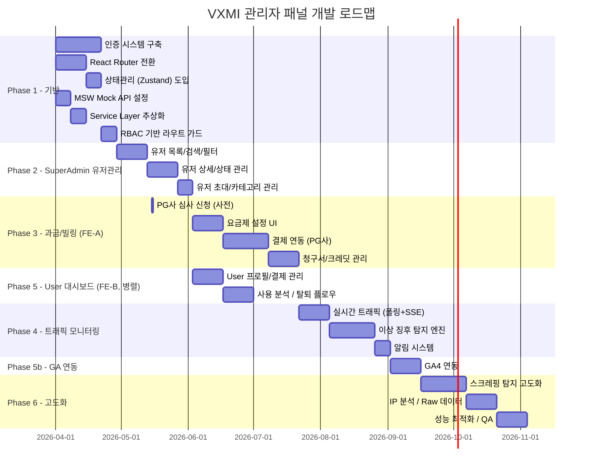

### 11.3 Phase 상세

#### Phase 1: 인증 시스템 + 기본 라우팅 + Mock API (4주)

| 태스크 | 설명 | 산출물 |
|---|---|---|
| React Router v7 도입 | `useState` 탭 -> URL 라우팅 전환 | 라우팅 설정, 기존 뷰 마이그레이션 |
| Zustand 도입 | 글로벌 상태관리 스토어 구축 | authStore, uiStore |
| MSW 설정 | Mock Service Worker 초기 설정 | msw/handlers, msw/browser.ts |
| Service Layer 추상화 | data/*.ts -> Service/Repository 패턴 | services/, 인터페이스 정의 |
| 이메일 로그인/가입 | JWT 인증 플로우, Mock 모달 대체 | 로그인/가입 페이지, Auth Service |
| Google OAuth 연동 | Google OAuth 2.0 Authorization Code Flow | OAuth 콜백 처리 |
| RBAC Route Guard | 계층형 역할별 접근 제어 컴포넌트 | AuthGuard, RoleGuard HOC |
| 레이아웃 전환 | 탭 -> 사이드바 + 탑바 레이아웃 | SideNav, TopBar 컴포넌트 |
| Silent Refresh 구현 | 페이지 새로고침 시 Access Token 복구 | initializeAuth() |

**완료 기준:**
- 이메일/Google 로그인 및 회원가입 동작
- URL 기반 네비게이션 동작 (기존 6개 뷰 모두)
- 미인증 시 로그인 리다이렉트 동작
- SuperAdmin/User/Guest 역할별 메뉴 분리
- MSW가 개발 환경에서 API Mock 제공
- 페이지 새로고침 시 인증 상태 유지 (Silent Refresh)

#### Phase 2: SuperAdmin 유저 관리 (5주)

| 태스크 | 설명 | 산출물 |
|---|---|---|
| 유저 목록 페이지 | 테이블 + 필터 + 검색 + 페이지네이션 | DataTable, FilterBar 컴포넌트 |
| 유저 상세 페이지 | 프로필/통계/과금/활동 섹션 | UserDetail 페이지 |
| 유저 상태 관리 | 활성/비활성/차단 상태 전환 | 차단 모달, 상태 변경 API 연동 |
| 유저 카테고리 관리 | 카테고리 변경 + 카테고리별 설정 | CategoryManager 컴포넌트 |
| 유저 초대 | 개별/일괄 초대 기능 | InviteModal, CSV 업로드 |

**완료 기준:**
- SuperAdmin이 전체 유저 목록을 필터/검색/정렬하여 조회 가능
- 유저 상세 정보, 사용 통계, 활동 로그 확인 가능
- 유저 차단/해제, 카테고리 변경 동작
- 이메일 초대 및 CSV 일괄 초대 동작

#### Phase 3: 과금/빌링 시스템 (7주, FE-A 담당)

| 태스크 | 설명 | 산출물 |
|---|---|---|
| PG사 심사 신청 | 토스페이먼츠 사전 심사 (사업자등록증 등) | 심사 통과 |
| 요금제 CRUD | 요금제 생성/수정/비활성화 UI | PlanManager 페이지 |
| PG사 연동 | 토스페이먼츠 SDK 통합 | 결제 위젯, 빌링키 관리 |
| 구독 관리 | 업그레이드/다운그레이드/해지 플로우 | SubscriptionManager |
| 청구서 시스템 | 자동/수동 청구서 생성, 세금계산서/현금영수증 | InvoiceList, InvoiceDetail |
| 할인/크레딧 | 쿠폰/크레딧 지급 및 차감 | CreditManager |
| 매출 분석 | 매출 추이/분포 차트 | RevenueDashboard |

**완료 기준:**
- 4개 요금제 (Free/Basic/Pro/Enterprise) 설정 완료
- 실제 카드 결제 처리 동작 (PG사 테스트 모드)
- 요금제 변경 시 일할 계산 및 자동 청구 동작
- 청구서 PDF 다운로드 가능
- 세금계산서 / 현금영수증 발행 동작

#### Phase 4: 트래픽 모니터링 (6주)

| 태스크 | 설명 | 산출물 |
|---|---|---|
| 실시간 대시보드 | RPM, 응답시간, 에러율 차트 (30초 폴링 -> SSE) | TrafficDashboard |
| SSE 연동 | `GET /api/v1/admin/traffic/stream` SSE 엔드포인트 | SSE client, Zustand stream store |
| 엔드포인트 분석 | 엔드포인트별 트래픽 통계 | EndpointTable |
| 이상 징후 탐지 | 9개 탐지 규칙 엔진 구현 | AlertEngine (백엔드) |
| 알림 관리 UI | 알림 목록/상세/상태 관리 | AlertList, AlertDetail |
| Rate Limiting | 역할별/유저별 차등 제한 | RateLimiter (백엔드) |

**완료 기준:**
- 실시간 트래픽 차트 업데이트 동작 (30초 폴링 -> SSE 전환)
- 9개 이상 징후 탐지 규칙 활성화
- 알림 수신 및 상태 관리 동작
- 임계값 초과 시 자동 Rate Limit 조정 동작

#### Phase 5: User 대시보드 + GA4 연동 (6주, 일부 병렬)

| 태스크 | 설명 | 산출물 | 담당 |
|---|---|---|---|
| User 프로필 | 프로필 조회/수정, 이메일 변경 | ProfilePage | FE-B (Phase 3과 병렬) |
| User 결제 관리 | 요금제 확인/변경, 결제 수단, 이력 | BillingPage (User) | FE-B |
| 사용 분석 | 기능 사용 통계, 검색 히스토리 | AnalyticsPage (User) | FE-B |
| 회원 탈퇴 | 탈퇴 플로우, 유예, 데이터 정책 | DeleteAccountPage | FE-B |
| GA4 SDK 통합 | gtag.js 초기화, 이벤트 래퍼 | GA4 Service | Phase 4 완료 후 |
| GA 대시보드 | KPI, 행동 분석, 퍼널 차트 | GADashboard (SuperAdmin) | Phase 4 완료 후 |

**완료 기준:**
- GA4 이벤트 정상 수집 확인 (GA Debug View)
- SuperAdmin GA 대시보드에서 주요 KPI 확인 가능
- User가 프로필, 결제, 사용 분석 셀프서비스 가능
- 회원 탈퇴 플로우 완전 동작 (유예 기간 포함)

#### Phase 6: 이상 징후 탐지 고도화 (7주)

| 태스크 | 설명 | 산출물 |
|---|---|---|
| 스크레핑 탐지 고도화 | 가중치 기반 스코어링, 자동 대응 | ScrapingDetector |
| IP 분석 | GeoIP, VPN 탐지, IP 화이트/블랙리스트 | IPAnalyzer |
| Raw 데이터 조회 | 쿼리 인터페이스, 결과 시각화 | DataExplorer (SuperAdmin) |
| 성능 최적화 | 번들 분석, 코드 스플리팅, 캐싱 | 최적화된 빌드 |
| 통합 QA | E2E 테스트, 부하 테스트, 보안 점검 | 테스트 리포트 |

**완료 기준:**
- 스크레핑 의심 유저 자동 탐지 및 차등 대응 동작
- IP 기반 분석 및 차단 관리 동작
- SuperAdmin Raw 데이터 조회 동작
- Lighthouse Performance Score 90+ 달성
- 주요 시나리오 E2E 테스트 커버리지 80%+

---

## 12. 성공 지표 (KPIs)

### 12.1 서비스 운영 KPI

| KPI | 측정 방법 | 목표치 |
|---|---|---|
| 시스템 가용성 (Uptime) | 모니터링 도구 | 99.9% |
| 평균 API 응답 시간 | P50 / P95 / P99 | P50 < 100ms, P95 < 500ms |
| 이상 징후 탐지율 | 실제 이상 / 탐지된 이상 | 95% 이상 |
| 이상 징후 오탐율 (False Positive) | 오탐 / 전체 알림 | 10% 미만 |
| 알림 평균 응답 시간 | 알림 발생 ~ 확인까지 | CRITICAL < 15분, WARNING < 1시간 |
| 로그인 성공률 | 성공 로그인 / 전체 시도 | 98% 이상 |
| 페이지 로드 시간 (FCP) | Lighthouse / GA4 | < 1.5초 |
| 에러율 | 5xx 응답 / 전체 응답 | < 0.1% |

### 12.2 비즈니스 KPI

| KPI | 측정 방법 | 목표치 (런칭 후) |
|---|---|---|
| 가입 전환율 | 가입 완료 / 랜딩 방문 | 15% |
| 활성화율 | 첫 분석 뷰 사용 / 가입 | 60% |
| 유료 전환율 | 유료 결제 / 전체 가입 | 10% |
| **MRR 3개월** | 월간 반복 매출 | 500만원 |
| **MRR 6개월** | 월간 반복 매출 | 2,000만원 |
| **MRR 12개월** | 월간 반복 매출 | 5,000만원 |
| ARPU (Average Revenue Per User) | MRR / 유료 유저 수 | 카테고리별 추적 |
| Churn Rate (이탈률) | 월간 해지 유저 / 전체 유료 유저 | < 5% |
| NPS (Net Promoter Score) | 정기 설문 | 40+ |
| DAU/MAU Ratio (Stickiness) | DAU / MAU | 30% 이상 |
| D7 리텐션 | 가입 7일 후 재방문 비율 | 40% 이상 |
| D30 리텐션 | 가입 30일 후 재방문 비율 | 20% 이상 |
| 카테고리별 사용량 | 카테고리별 평균 API 호출 | 헤드헌터 > 인하우스HR > B2C |
| 고객 지원 요청량 | 월간 문의 건수 | 유저 1000명당 < 50건 |

### 12.3 KPI 모니터링 체계

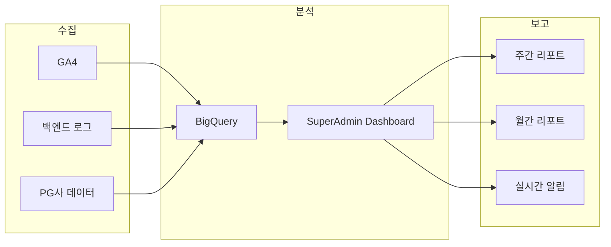

---

## 13. 리스크 & 대응방안

### 13.1 기술 리스크

| 리스크 | 영향도 | 발생 확률 | 대응 방안 |
|---|---|---|---|
| **React Router 전환 시 기존 뷰 동작 이슈** | 중 | 중 | 단계적 마이그레이션. 기존 탭 네비게이션을 라우터 내부에서 유지한 후 점진 전환. E2E 테스트 선행 작성. |
| **PG사 결제 연동 지연** | 높 | 중 | 토스페이먼츠 + NHN KCP 이중 준비. PG사 심사 기간 (2-4주) 감안하여 Phase 3 초기에 심사 신청. |
| **실시간 트래픽 모니터링 성능** | 높 | 낮 | 30초 폴링으로 시작, SSE(Server-Sent Events) 전환. 부하 테스트 후 필요 시 WebSocket 검토 (Phase 6+). |
| **대량 트래픽 로그 스토리지** | 중 | 높 | 초기 PostgreSQL 파티셔닝으로 시작, 데이터 증가 시 TimescaleDB 또는 ClickHouse 전환 계획. |
| **GA4 API 할당량 초과** | 낮 | 낮 | GA4 Data API 일일 할당량 모니터링. 캐싱 레이어 도입 (Redis, 1시간 TTL). |
| **JWT 보안 취약점** | 높 | 낮 | RS256 사용, Access Token은 메모리 저장, Refresh Token Rotation, 짧은 Access Token 수명 (15분). 정기 보안 감사. |

### 13.2 비즈니스 리스크

| 리스크 | 영향도 | 발생 확률 | 대응 방안 |
|---|---|---|---|
| **유료 전환율 저조** | 높 | 중 | Free 요금제의 기능을 충분히 제한하여 가치 인지 유도. A/B 테스트를 통한 Paywall 위치 최적화. |
| **카테고리 오분류** | 중 | 중 | 가입 시 카테고리 선택 가이드 제공. SuperAdmin이 수동 검증 후 조정. 인하우스HR/헤드헌터는 증빙 서류 요청. |
| **스크레핑/데이터 탈취** | 높 | 중 | 다중 탐지 시그널 조합. Rate Limiting + 행동 분석. 법적 대응 준비 (이용약관 명시). |
| **개인정보보호법 위반** | 높 | 낮 | 개인정보처리방침 법률 검토. 최소 수집 원칙. 데이터 보존 기간 준수. 정기 컴플라이언스 감사. |
| **경쟁사 유사 서비스 출시** | 중 | 중 | 차별화된 데이터 품질 + UX 집중. 카테고리별 맞춤 기능으로 Lock-in 효과. |

### 13.3 운영 리스크

| 리스크 | 영향도 | 발생 확률 | 대응 방안 |
|---|---|---|---|
| **SuperAdmin 부재 시 긴급 대응** | 높 | 낮 | 최소 2명 이상 SuperAdmin 유지. 자동 대응 규칙 (Rate Limit, 차단) 설정. Slack 알림 에스컬레이션. |
| **결제 장애 (PG사 다운)** | 높 | 낮 | PG사 이중화. 결제 실패 시 자동 재시도 (24시간 내 3회). 유저에게 실패 안내 + 수동 결제 링크 제공. |
| **데이터 유실** | 높 | 낮 | 일일 자동 백업 + 실시간 레플리카. RTO < 1시간, RPO < 5분 목표. |

### 13.4 법적/규제 리스크

| 리스크 | 영향도 | 발생 확률 | 대응 방안 |
|---|---|---|---|
| **전자금융거래법 준수** | 높 | 중 | 정기결제 서비스 운영 시 전자금융거래법 요건 확인. PG사 이용 시 전자금융업 등록 면제 여부 검토. 이용약관에 자동결제 동의 조항 명시. |
| **PCI DSS 책임 분담** | 높 | 낮 | 토스페이먼츠 SDK 사용 시 카드 정보가 서버를 통과하지 않으므로 SAQ A 수준. 빌링키만 보관하며, 카드 원본 정보는 PG사가 관리. PCI DSS 책임 범위를 계약서에 명시. |
| **개인정보 국외 이전** | 중 | 중 | GA4 데이터가 Google 서버(미국)에 저장됨. 개인정보처리방침에 국외 이전 사항 고지. 필요 시 GA4 데이터 보존 기간 설정. |

### 13.5 인력 리스크

| 리스크 | 영향도 | 발생 확률 | 대응 방안 |
|---|---|---|---|
| **핵심 인력 이탈** | 높 | 중 | 코드 리뷰 문화로 지식 공유. 주요 설계 결정은 PRD/ADR 문서화. Phase별 인수인계 가능한 수준의 문서 유지. 최소 2명이 각 모듈을 이해하도록 페어 프로그래밍. |
| **QA/디자인 리소스 부족** | 중 | 높 | Phase별 집중 투입 스케줄링. 자동화 테스트로 수동 QA 부담 최소화. 디자인 시스템 구축으로 반복 디자인 최소화. |

### 13.6 리스크 우선순위 매트릭스

```
        높은 영향
           |
    [PG연동지연]  [스크레핑]  [결제장애]  [데이터유실]
    [유료전환]    [JWT보안]   [SuperAdmin부재]  [인력이탈]
    [전자금융법]
           |
    -------+-------- 높은 확률
           |
    [Router전환]  [카테고리오분류]  [QA리소스]
    [트래픽로그]  [경쟁사]  [국외이전]
           |
    [GA할당량]  [PCI DSS]
           |
        낮은 영향
```

---

## 부록

### A. 기술 스택 요약

| 레이어 | 기술 | 비고 |
|---|---|---|
| Frontend Framework | React 19 | 기존 유지 |
| Language | TypeScript 5.9 | 기존 유지 |
| Build Tool | Vite 8 | 기존 유지 |
| Styling | Tailwind CSS 4 | 기존 유지 |
| Charts | Recharts 3 | 기존 유지 |
| Routing | React Router v7 | **신규** |
| State Management (Client) | Zustand | **신규** |
| State Management (Server) | TanStack Query (권장) | **신규** |
| HTTP Client | Axios | **신규** |
| Form Handling | React Hook Form + Zod | **신규** |
| Authentication | JWT (RS256) + Google OAuth | **신규** |
| Mock API | MSW (Mock Service Worker) | **신규** |
| Analytics | Google Analytics 4 (gtag.js) | **신규** |
| Payment | 토스페이먼츠 SDK | **신규** |
| Testing | Vitest + React Testing Library + Playwright | **신규** |

### B. 관련 문서

| 문서 | 설명 |
|---|---|
| 기존 대시보드 README | `/vxmi-dashboard/README.md` |
| API 서버 PRD | 별도 작성 예정 |
| 디자인 시스템 가이드 | 별도 작성 예정 |
| 보안 가이드라인 | 별도 작성 예정 |
| 개인정보처리방침 | 법무팀 협의 후 작성 |

### C. 변경 이력

| 버전 | 날짜 | 작성자 | 변경 내용 |
|---|---|---|---|
| v1.0 | 2026-03-20 | 프로덕트팀 | 최초 작성 |
| v1.1 | 2026-03-20 | 프로덕트팀 | Architect/Critic Review 반영: 계층형 RBAC 구조 수정, 인증 아키텍처 명확화 (Access Token 메모리 저장, Silent Refresh), API 호출 한도 규칙 명확화 (요금제 기준), MSW Mock API 전략 추가, 팀 구성/인력 배분 추가, X-Admin-Override 헤더 제거 (JWT role claim 기반), 누락 데이터 모델 6종 추가, Pagination 전략 엔드포인트별 명시, WebSocket -> SSE 전환, 에러 형식 통일, TanStack Query 권장, 한국 결제 특수 요구사항, 프론트엔드 테스트 전략, 법적/규제 리스크, MRR 목표치 |

---

> **본 문서는 밸류커넥트 내부 기밀 문서입니다. 외부 유출을 금합니다.**
